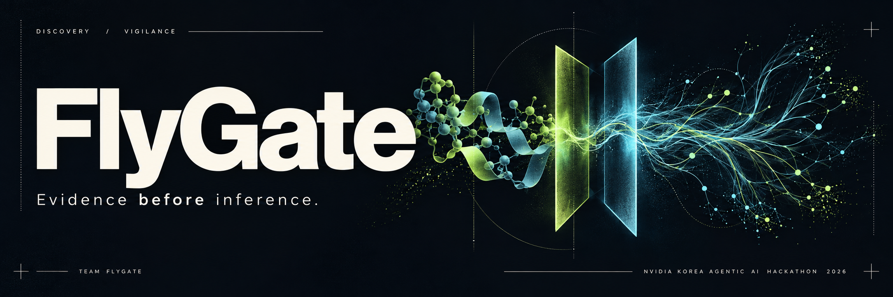
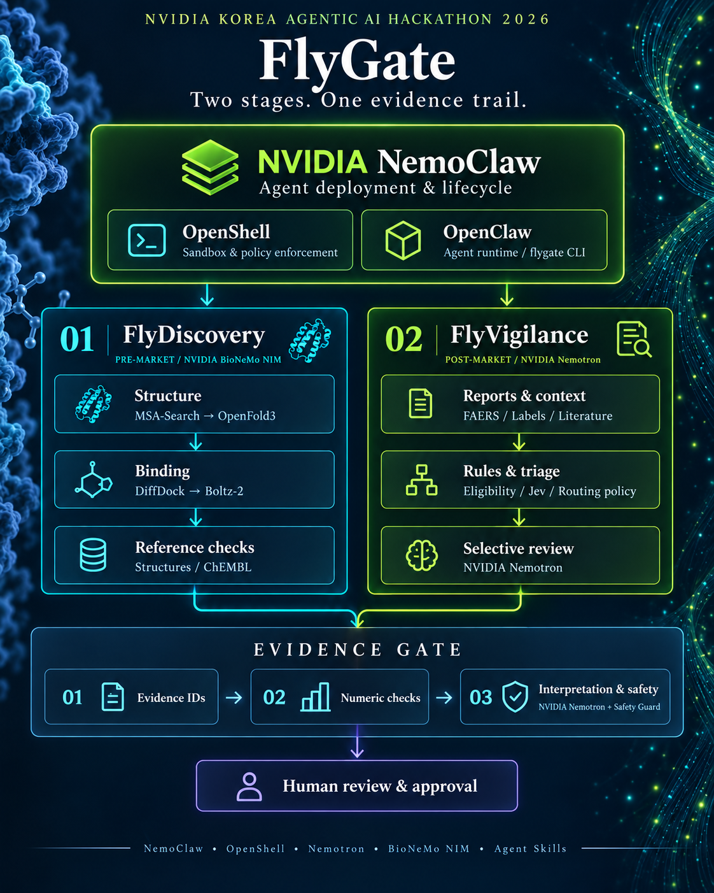
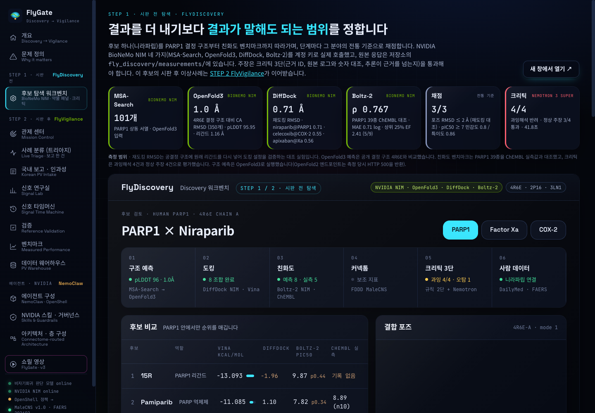
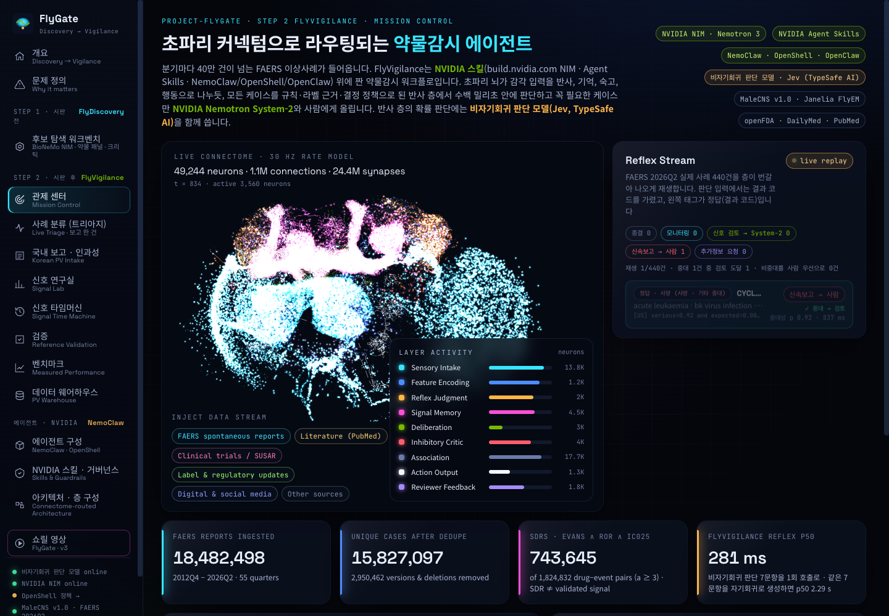
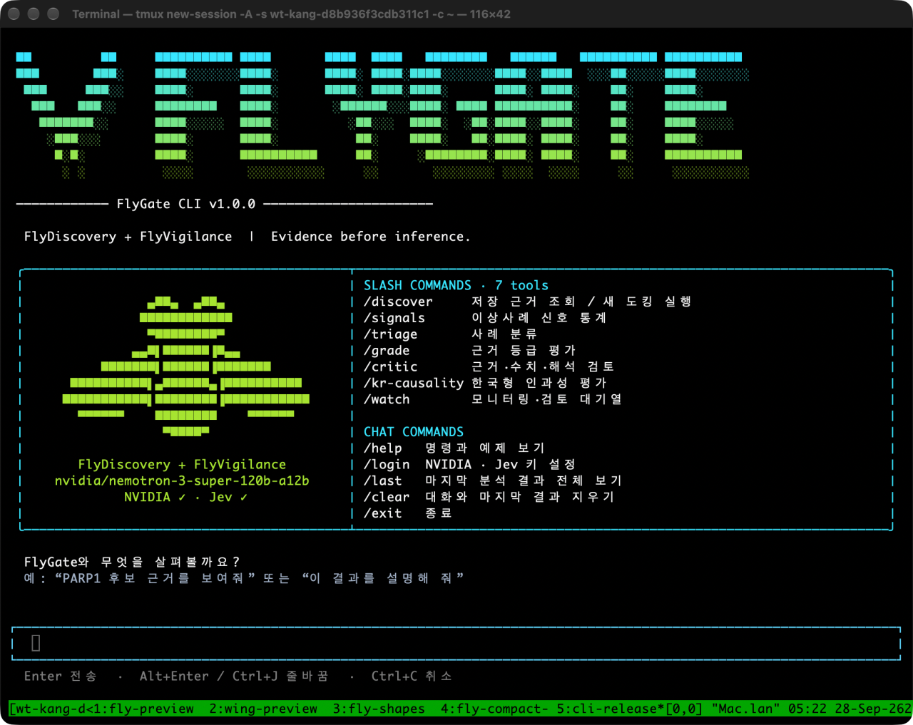
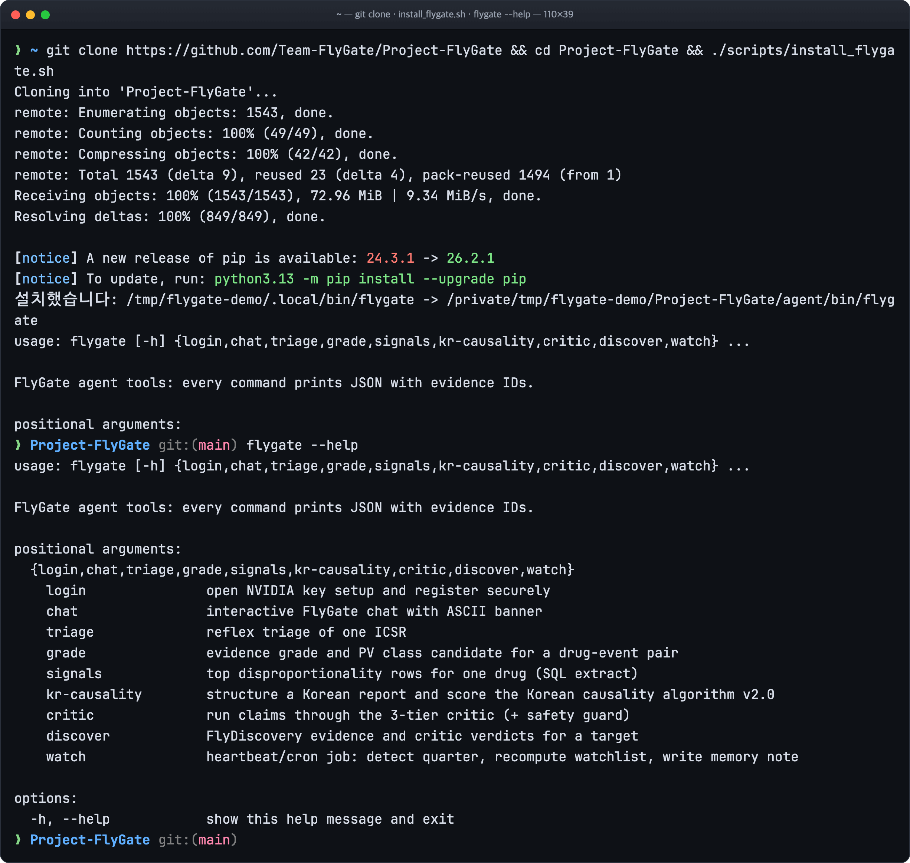

[한국어](README.md) · **English**

<p align="center">
  <a href="https://flygate.kr"></a>
</p>

<p align="center"><strong>From molecule to patient, evidence before inference. FlyGate.</strong></p>
<p align="center">NVIDIA Korea Agentic AI Hackathon 2026 · Team FlyGate</p>
<p align="center">
  <a href="https://flygate.kr"><strong>Live dashboard ↗</strong></a> &nbsp; · &nbsp;
  <a href="https://flygate.kr/showreel/FlyGate_showreel_v4.3.0-en.html">Showreel ↗</a> &nbsp; · &nbsp;
  <a href="docs/EVALUATION.md">Evaluation report (Korean)</a> &nbsp; · &nbsp;
  <a href="https://flygate.kr/#/glossary">Glossary ↗</a> &nbsp; · &nbsp;
  <a href="#06--meet-the-team">Team</a> &nbsp; · &nbsp;
  <a href="#07--build--run">Quickstart</a>
</p>

---

## 01 / Two perspectives. One evidence trail.

**FlyGate = FlyDiscovery + FlyVigilance.** Before a drug reaches the market, FlyGate checks how candidate compounds bind their target; after approval, it watches the adverse events (anything harmful that happens after a patient takes a drug) reported for marketed drugs.

The demo uses niraparib, an already-approved inhibitor of PARP1 (a protein that repairs DNA damage). We retrace its pre-market stage and then follow the same drug into its real post-market reports. Both stages work unchanged for other targets and other drugs.

| | |
| --- | --- |
| Live dashboard | https://flygate.kr |
| Showreel v4.3 (full cut, 4 min 10 s · features the FlyGate Agent CLI on a real terminal) | [Web (English)](https://flygate.kr/showreel/FlyGate_showreel_v4.3.0-en.html) · [Web (Korean)](https://flygate.kr/showreel/FlyGate_showreel_v4.3.0.html) · [MP4 (Korean)](https://github.com/Team-FlyGate/Project-FlyGate/releases/download/v4.3/FlyGate_showreel_v4.3.0.mp4) · [Narration script (Korean)](docs/SHOWREEL_SCRIPT_v4.3.0.md) |
| Showreel v3 (earlier cut, 2 min 9 s, Korean) | [Web](https://flygate.kr/showreel/FlyGate_showreel_v3.0.0.html) · [MP4](https://github.com/Team-FlyGate/Project-FlyGate/releases/download/v3.0/FlyGate_showreel_v3.0.0.mp4) |
| Teaser (15 s) | [Web](https://flygate.kr/showreel/FlyGate_teaser_15s_v1.1.0.html) · [MP4 landscape · portrait](https://github.com/Team-FlyGate/Project-FlyGate/releases/tag/teaser-v1.1) |
| Agent setup (NemoClaw · OpenShell · OpenClaw: NVIDIA's agent deployment stack · policy sandbox · agent harness) | [docs/AGENT.md](docs/AGENT.md) · [agent/](agent/) |
| Evaluation report (Korean) | [docs/EVALUATION.md](docs/EVALUATION.md) |
| Pharmacist review log (Korean) | [docs/PHARMACIST_REVIEW.md](docs/PHARMACIST_REVIEW.md) |

Project-FlyGate is an **agentic workflow built on NVIDIA Skills**. It uses build.nvidia.com NIM (NVIDIA Inference Microservices: AI models packaged so they can be called directly through a standard API), NVIDIA Agent Skills (a packaging standard for agent capabilities), and NemoClaw · OpenShell · OpenClaw.
Tasks that require writing text go to NVIDIA Nemotron (NVIDIA's family of language models), while judgments that only need a probability are handled by **a non-autoregressive judgment model used alongside it**. A non-autoregressive judgment model does not generate text token by token; it returns the probabilities for a fixed set of questions in a single pass. This pairing delivers high speed and statistically significant improvements.

<p align="center"></p>
<p align="center"><sub>The hero and module art are AI-generated concept images and do not depict real molecular structures or clinical data.</sub></p>

| Step | Name | What it does |
| --- | --- | --- |
| STEP 1 · Pre-market | **FlyDiscovery** | Evaluates candidate compounds with NVIDIA BioNeMo NIM (a suite of structural biology and drug discovery models): target (the protein a drug binds to act on) structure prediction → docking (computationally fitting how a drug molecule sits in the binding site) → affinity (how strongly the drug binds the target). It rejects claims that go beyond the evidence (demo: niraparib · PARP1, two comparator drugs, a 39-compound affinity benchmark) |
| STEP 2 · Post-market | **FlyVigilance** | Triages adverse event reports from FAERS (the U.S. Food and Drug Administration's Adverse Event Reporting System) one case at a time (triage: the first step that sorts cases by urgency and assigns a handling route), backed by an SDR table covering 2,563 drugs (SDR, signal of disproportionate reporting: a statistical signal that a drug–reaction pair is reported unusually often compared with other drugs). It assigns a PV (pharmacovigilance) class (a review priority set by label status × SDR) using SDRs, the label (the official prescribing information approved by the regulator) and the literature, and builds a human review queue with expedited reporting deadlines (the obligation to report important cases to the regulator within a fixed window) |

## 02 / Measured, not assumed.

Each evaluation question is shown with its measured result and data scope. Detailed conditions and reproduction steps are in the [evaluation report (Korean)](docs/EVALUATION.md).

| Question | Result | Data |
| --- | --- | --- |
| Does it cut human workload without missing serious cases? | With outcome codes (the death, hospitalization and similar flags attached to a report) hidden, **247/250** serious cases (cases with severe outcomes such as death, life threat, hospitalization or disability) reached review (a single model question alone: 234/250; McNemar test (a paired comparison test) p (the probability of a difference this large arising by chance) = 0.0044). Human-priority workload was **138 cases**, less than half of the single-question approach (302) (p = 3.6×10⁻⁴⁸) | 440 real FAERS cases |
| Is it fast? | A 7-question judgment framed in regulatory terms takes **296 ms** in a single call. Solving the same questions with autoregressive generation (writing one token at a time, each conditioned on the previous ones) takes 2,286 ms | The same 27 cases |
| Does it recognize established drug–adverse reaction associations? | FlyVigilance's knowledge-based discrimination (judging from drug and reaction names whether an association is established) reaches AUC (area under the ROC curve, a discrimination score where 0.5 is random and 1 is perfect) **0.960** (OMOP) and **0.983** (EU-ADR), significantly above the best statistical metrics (0.815, 0.919) | Public reference sets (OMOP · EU-ADR: evaluation lists with predefined ground truth), 480 pairs |
| Do disproportionality metrics catch labeled reactions? (pilot) | On a 64,796-pair reference set of labeled reactions, the Evans rule (a classic disproportionality threshold) has sensitivity (the share of true positives it catches) of **0.30**, and the lower-bound metrics (ROR₀₂₅, the lower bound of the reporting odds ratio · IC₀₂₅, the lower bound of the information component) reach AUC **0.62–0.63**. More than half of the labeled pairs never raise an SDR ([Evaluation 1-6, Korean](docs/EVALUATION.md#1-6-sider-라벨-기재-참조-세트-파일럿-하네스-저장소)) | SIDER 4.1 (a public database of side effects from drug labels), about 31 drugs · team's prior repository |
| Does mechanistic evidence separate labeled from unlabeled reactions? (pilot) | The Open Targets (a public target–disease association database) target–disease association score reaches AUC **0.559** (null 0.532: the baseline when labels are shuffled at random), lower than the disproportionality metrics on the same rows (0.570–0.679). 68.4% of evaluated rows score zero ([Evaluation 7, Korean](docs/EVALUATION.md#7-기전-타당성-축-파일럿-open-targets)) | Open Targets 26.09 · 17,472 pairs |
| Could we have known before the label changed? | Using only reports filed before 2013, an SDR appeared for **21** of the 57 label changes made that year, with **1** false alarm among 70 negatives (PPV (positive predictive value: the share of positive calls that are truly positive) **0.95**) | Legacy AERS (the pre-FAERS system used through 2012), 2004–2012 |
| Does it block overinterpretation (conclusions that go beyond what the evidence allows)? | It rejected **31/31** deliberately planted false claims and passed 6/6 valid ones. When a PV policy built with the official skill `nemotron-policy-generator` is loaded into Nemotron 3.5 Content Safety (NVIDIA's safety classification model), the guard layer alone catches **7/7** causal claims drawn from the PRR (proportional reporting ratio) and **8/8** fabricated incidence rates (default guard: 0/7, 0/8) | 8 real serious cases · 50 evaluation sentences |
| Does it read the literature correctly? | Study-design classification agrees with MEDLINE (the index database of biomedical literature) indexing **92.0%** of the time. Reordering candidates with the NVIDIA Nemotron reranker (a model that re-sorts search results by relevance) raised the share of relevant papers among the six it reads from **0.65 → 0.85** (21 pairs improved, 0 worse) | 598 PubMed (biomedical literature search service) papers · 575 papers in 30 pairs |
| Are the pre-market predictions trustworthy? | OpenFold3 (a protein–ligand complex structure prediction model) PARP1 structure CA RMSD (root-mean-square deviation from the experimentally solved crystal structure; smaller is more accurate, and 1 Å is 0.1 nanometer) **1.0 Å**; DiffDock (a binding-pose prediction model) redocking (a control experiment that removes the original drug from the crystal structure and docks it again to see if it finds its place) **0.71 Å**; Boltz-2 (a binding-affinity prediction model) affinity Spearman (rank correlation, where 1 means identical ordering) **0.767** | 4R6E (the PDB ID of the PARP1–niraparib crystal structure), 39 compounds from ChEMBL (a public database of experimental compound activities) |

### Summary by judging criterion

| Judging criterion | Evidence from Project-FlyGate |
| --- | --- |
| **Depth of NVIDIA agent technology use** | Nemotron 3 Super · Ultra · Lightning (System-2 assessment and form structuring; System-2 is the deliberative stage that escalates only the cases that need it and weighs the gathered evidence slowly), Safety Guard 8B v3 (NVIDIA's safety classification model) + Nemotron 3.5 Content Safety (PV policy), the Nemotron reranker, and four BioNeMo NIMs. Four official NVIDIA Agent Skills are applied in the real pipeline. The OpenClaw agent runs inside an OpenShell sandbox (an execution space isolated from the outside), verified by a smoke test (basic operation check) at 20/20, plus heartbeat (periodic self-check) and cron (scheduled execution) (mapping to NemoClaw course modules 01a–04c: [docs/AGENT.md](docs/AGENT.md)) |
| **Practicality · industry value · innovation** | It routes 420,000 FAERS reports per quarter into human priority · System-2 · request for more information · monitoring. With outcome codes hidden, 247/250 serious cases reach review, and human workload drops from 302 to 138 cases. It supports U.S. and Korean 15-day rule modes and the Korean causality assessment (how likely it is that the drug caused the reaction), and incorporates 15 review items from a practicing pharmacist |
| **Completeness** | A live dashboard and API (the interface through which programs exchange requests and responses), a real FAERS warehouse (a database organized for analysis) spanning 55 quarters, validation on three public reference sets, 147 offline tests, reproduction scripts, and showreel v3 |
| **Customization · originality** | Judgment is handled by a non-autoregressive model (7 questions in 296 ms) and writing by Nemotron. A 13-rule overinterpretation critic (a checking stage that rejects claims beyond the evidence) and a pharmacovigilance-specific guard policy are in place, and pre-market binding prediction and post-market surveillance are joined in a single agent |

## 03 / Why FlyGate

Drug safety reviewers gather scattered evidence and write a judgment: docking scores, reference affinities, approved labels, adverse event reports and the literature.
- **Volume**: FAERS receives more than 420,000 reports per quarter (422,459 in 2026Q2).
- **Allocation**: Screening with a single question either over-routes cases to humans to avoid missing serious ones, or leaves serious cases in an automated queue that no one reads.
- **Overinterpretation**: Some claims have every number and source right, yet the conclusion goes beyond the evidence — for example, inferring selectivity (how exclusively a drug binds the intended target) from docking scores on different proteins, or reading a disproportionality metric (PRR) as causation. Format checks do not catch these.

### Two stages, one agent

Two stages, one agent. In a deployment built on **NVIDIA NemoClaw**, **OpenClaw** runs as the agent and **NVIDIA OpenShell** enforces file and network access policies and sandbox isolation. The agent runs both modules through the `flygate` CLI (command-line interface).

<a href="docs/images/flygate-architecture_v2.1.0.png"></a>

<sub>A summary of the core processing path. The model is not called for every case; rules and the decision policy route cases to human priority · System-2 · request for more information · monitoring.</sub>

- **FlyDiscovery:** PARP1 sequence → MSA-Search (multiple sequence alignment: collecting and aligning evolutionarily related protein sequences) → OpenFold3 structure → DiffDock pose (the position and orientation of the drug molecule) → Boltz-2 affinity → conventional-criteria scoring → three-stage critic.
- **FlyVigilance:** FAERS case → check of the ICH (International Council for Harmonisation of Technical Requirements for Pharmaceuticals for Human Use) four minimum elements (reporter · patient · suspect drug · adverse event) → lookup of the FDA label text → 7-question judgment → decision policy (a rule table that turns probabilities into actions and deadlines) with the EMA (European Medicines Agency) DME (Designated Medical Events: adverse events EMA flags for special attention) safety net. Only the cases that need it are sent to Nemotron assessment, the critic and Safety Guard.
- **Shared case:** Niraparib's pre-market predictions are linked to its post-market evidence. Humans make the final call on reports and submit them.

| Component | What it does | Model |
| --- | --- | --- |
| Rule gate | Anything rules can decide — ICH four minimum elements, outcome codes, drug role — is never sent to a model | None |
| Label text lookup | Determines from the source text which section of the FDA-approved label mentions the reaction (boxed warning: the strongest warning at the top of the label · warnings · clinical trials · postmarketing). Mentions in contraindication (conditions where the drug must not be used) or indication (the diseases the drug is approved for) context are not counted as labeled | None |
| Reflex judgment | Returns probabilities for seven questions at once, including seriousness · expectedness (whether the reaction is already listed on the label) · causal possibility | Non-autoregressive judgment model |
| Decision policy | Turns probabilities into actions and deadlines. Provides U.S. (serious + unexpected) and Korean (serious adverse drug reaction) 15-day rule modes | None |
| SDR statistics | Computes PRR · ROR (reporting odds ratio) · IC₀₂₅ and the triple criterion (passing all of the Evans criteria · ROR₀₂₅ > 1 · IC₀₂₅ > 0) in SQL (the database query language). The model cannot change the numbers | None |
| PV class | Sets review priority by label status × SDR and adds flags for boxed warning · DME · reporting bias (statistics inflated because litigation, media coverage and the like concentrate certain reports) | None |
| Knowledge-based discrimination | Gives the probability that a drug–reaction name pair is an established association (reference axis) | Non-autoregressive judgment model |
| Literature reading | First asks whether a PubMed abstract actually addresses the reaction, then reads design-specific items | Non-autoregressive judgment model |
| System-2 assessment | Writes assessment memos only for escalated cases, attaching evidence IDs (unique identifiers of the sources a claim relies on) | NVIDIA Nemotron 3 Super |
| Three-stage critic | ① evidence IDs exist ② numeric oracle (checks the numbers in a sentence against the source values) ③ 13 overinterpretation rules + safety guard | Judgment model, NVIDIA Nemotron Safety Guard |
| Human approval | There is no path that sends a report outside. Humans make the final call and submit | – |

Detailed architecture is in [docs/ARCHITECTURE.md](docs/ARCHITECTURE.md), and the agent deployment in [docs/AGENT.md](docs/AGENT.md).

## 04 / Built with NVIDIA

| Technology | Where | Notes |
| --- | --- | --- |
| **NVIDIA Nemotron 3 Super 120B** (`nvidia/nemotron-3-super-120b-a12b`) | System-2 assessment memos, structuring of Korean domestic report forms, FlyDiscovery critic verdicts | Ultra 550B → 3.5 Lightning 30B fallback chain (the backup path when the primary model does not respond), NIM JSON (a structured text data format) mode |
| **NVIDIA Nemotron Safety Guard 8B v3** + **Nemotron 3.5 Content Safety (PV policy)** | Runs both guards in parallel on every claim in a memo to reject treatment advice, causal claims drawn from the PRR, incidence rates derived from spontaneous reports, and re-identification attempts | The PV policy is generated with the official skill `nemotron-policy-generator` and passed as `custom_policy`; accuracy on 50 evaluation items 0.58 → 0.84 |
| **NVIDIA Nemotron reranker** (`llama-nemotron-rerank-vl-1b-v2`) | Reorders 20 PubMed candidates before literature reading | Follows the official skill `nemotron-retrieval-recipes`; median added latency 0.57 s |
| **NVIDIA BioNeMo NIM** | MSA-Search → OpenFold3 → DiffDock → Boltz-2 | Follows the official skill `bionemo-msa-structure-prediction-pipeline` specification |
| **NVIDIA Agent Skills** ([NVIDIA/skills](https://github.com/NVIDIA/skills)) | Packages our 11 capabilities as [skills/*/SKILL.md](skills/) files and skill cards in the official format, and applies the official skills `bionemo-msa-structure-prediction-pipeline` · `nemotron-policy-generator` · `nemotron-retrieval-recipes` · `skill-card-generator` in practice | List: [skills/README.md](skills/README.md) |
| **NemoClaw · OpenShell · OpenClaw** | OpenClaw workspace (SOUL · AGENTS · TOOLS · HEARTBEAT), a deny-by-default network policy (all outbound connections blocked by default, with only listed destinations allowed), a Landlock (a Linux feature that restricts file path access) file system, non-root (no administrator privileges) execution | [agent/policy/flygate.yaml](agent/policy/flygate.yaml), real OpenShell sandbox smoke test passed **20/20** [agent/evidence/](agent/evidence/) |

For the non-autoregressive judgment model, FlyVigilance uses Jev by TypeSafe AI.

### Evidence map · NVIDIA call log

Each NVIDIA technology is linked to its code, its screen in the running app, the architecture diagram and a real call record. On 2026-09-28 we called every model and endpoint once for real and kept the request ID (`NVCF-REQID`, the receipt number NVIDIA's servers attach to each call). The log keeps only metadata, never API keys or prompts. The full table and 56 earlier measured calls are in [docs/NVIDIA_CALL_LOG_v1.0.0.md](docs/NVIDIA_CALL_LOG_v1.0.0.md), and the screen is at [#/calls](https://flygate.kr/#/calls).

| NVIDIA technology | Code | Screen | Architecture diagram | Call record (status · latency · first 8 characters of request ID) |
| --- | --- | --- | --- | --- |
| Nemotron 3 Super · Ultra · 3.5 Lightning | `api/_fv/assess.py:assess`, `kr.py:intake` → `clients.py:nim_chat` | `#/triage`, `#/korea` | [flygate-architecture_v2.1.0.png](docs/images/flygate-architecture_v2.1.0.png) | 200 · 5.2 s · `12efeb74` / 200 · 19.2 s · `5e2d7d44` / Lightning: one ReadTimeout, then rerun 200 · 7.2 s · `78c8987a` |
| Safety Guard 8B v3 + Content Safety PV policy | `assess.py:guard` · `policy_guard` | `#/triage`, `#/skills` | `#/architecture` (Inhibitory Critic) | 200 · 1.6 s · `c4010a57` / 200 · 0.5 s · `cda0506e` |
| Nemotron reranker | `literature.py:rerank` → `clients.py:nim_rerank` | `#/signals`, `#/triage` | `#/architecture` (Signal Memory) | 200 · 0.3 s · `fc620f5c` |
| Nemotron 3 Embed 1B | `clients.py:nim_embed` | Evaluation baseline | `#/architecture` (Feature Encoding) | 200 · 0.2 s · `2930f386` |
| BioNeMo MSA-Search → OpenFold3 | `pipeline/bench/nvidia_call_audit.py:nvcf_call` (raw responses in `fly_discovery/measurements/nim/`) | `#/d-msa`, `#/d-of3` | Same diagram (FlyDiscovery) | 200 · 4.5 s · `2e4f60c3` / 200 · 144.6 s · `a2623953` |
| BioNeMo DiffDock | `api/_fv/dock.py:dock`, `docking.py:execute` (CLI) | `#/d-diffdock`, `#/cli` | Same diagram | 200 · 1.1 s · `748a9d63` + 4 CLI runs |
| BioNeMo Boltz-2 | `nvidia_call_audit.py:nvcf_call` | `#/d-boltz` | Same diagram | 200 · 10.3 s · `41a6eab2` |
| NemoClaw · OpenShell | `agent/policy/flygate.yaml` | `#/agent` | [flygate_agent_diagram_v1.1.0.png](docs/images/flygate_agent_diagram_v1.1.0.png) | `/v1/models` 200 from inside the sandbox ([agent/evidence/](agent/evidence/)) |

### Expert review

We incorporated 15 review comments from a practicing pharmacist. The main items are below ([full log, Korean](docs/PHARMACIST_REVIEW.md)).
- A state that crosses the statistical threshold is called an **SDR** (signal of disproportionate reporting), and the **PV class** (label status × SDR) and review priority come first instead of a one-letter grade.
- When any of the **62 EMA DME PTs** (MedDRA PT: the preferred term for an adverse reaction in the MedDRA standard terminology) is reported, the case goes to human review regardless of score.
- **Reporting bias flag**: For isotretinoin–inflammatory bowel disease, 94.9% of reports come from lawyers, so a sensitivity analysis (checking whether results hold when conditions change) excluding lawyer reports is shown alongside.
- **Mentions in the label's contraindications section are not counted as labeled**, and adverse reactions are split between clinical trials and postmarketing.
- The **Korean 15-day rule** is applied on the basis of serious adverse drug reactions (causality cannot be ruled out).
- The primary measurement is made **with outcome codes hidden**.

## 05 / Inside the workbench

<table>
<tr><td width="50%"><strong>01 / FlyDiscovery</strong><br><sub>Structure, binding and affinity, with claim verification</sub></td><td width="50%"><strong>02 / FlyVigilance</strong><br><sub>Adverse events, review routes and safety evidence</sub></td></tr>
<tr><td><a href="docs/images/flydiscovery-workbench_v2.0.0.png"></a></td><td><a href="docs/images/flyvigilance-workbench_v2.0.0.png"></a></td></tr>
</table>

<sub>Real screens from the live demo. Click an image to view it at full size.</sub>

| Screen | Contents |
| --- | --- |
| Overview | The two gates (STEP 1 pre-market · STEP 2 post-market) and the flow of the demo drug niraparib |
| Candidate discovery | FlyDiscovery: candidate comparison, 3D binding poses, claim verification, affinity benchmark |
| Control center · case triage | Replays the triage results for 440 real FAERS cases side by side with the ground truth (outcome codes), and runs a chosen case through reflex judgment → routing → Nemotron deliberation → critic on the real API |
| Korean reporting · causality | Korean domestic form structuring (Nemotron) and the Korean causality assessment algorithm ver 2.0 |
| Signal lab · signal time machine | SDR rankings, PV class cards, and quarter-by-quarter recalculation for 8 FDA actions |
| Validation · benchmarks | ROC (sensitivity versus false-alarm rate curve) on public reference sets, and the comparison experiment with outcome codes hidden |
| Agent setup | OpenShell policy, OpenClaw workspace, skills |

The MaleCNS fruit fly connectome screen (the wiring diagram of neuron-to-neuron connections in the brain, 49,244 neurons) visualizes the agent's routing topology.

## 06 / Meet the team

We bring together immunology, bio data, medical imaging AI, pharmacy and agent development into a single review flow.

<table>
<tr>
<td align="center" width="20%"><a href="https://github.com/kakyungkim"><br><strong>Ka-Kyung Kim</strong><br>김가경</a><br><sub>TEAM COORDINATION<br>PV EVIDENCE</sub></td>
<td align="center" width="20%"><a href="https://github.com/AwesomeZun"><br><strong>Seong-Jun Kang</strong><br>강성준</a><br><sub>INTEGRATION<br>FLYVIGILANCE</sub></td>
<td align="center" width="20%"><a href="https://github.com/Geongyu"><br><strong>Geon-Gyu LEE</strong><br>이건규</a><br><sub>FLYDISCOVERY<br>AI & INTERFACE</sub></td>
<td align="center" width="20%"><a href="https://github.com/ybaeus"><br><strong>Yeji Bae</strong><br>배예지</a><br><sub>AGENT WORKFLOWS<br>PV EXTENSION</sub></td>
<td align="center" width="20%"><a href="https://github.com/YMYDGenie"><br><strong>Eunjin Jeon</strong><br>전은진</a><br><sub>PHARMACY<br>DOMAIN REVIEW</sub></td>
</tr>
</table>

| Member | Background | Contribution to FlyGate |
| :--- | :--- | :--- |
| **Ka-Kyung Kim** · [@kakyungkim](https://github.com/kakyungkim) | Bio data analysis · experience analyzing circulating tumor cells and drug development biomarkers | FlyVigilance development · team coordination and submission planning · pharmacovigilance evidence design · report form mapping and evidence grading rules |
| **Seong-Jun Kang** <sup><a href="https://kangseongjun.com" title="Seong-Jun Kang's personal website">↗</a></sup> · [@AwesomeZun](https://github.com/AwesomeZun) | Single-cell and spatial omics · drug candidate evaluation · author of *AI Drug Discovery: A Practical Guide* (Korean) | FlyVigilance and FlyDiscovery development · data and evaluation pipelines · integration and visualization of both modules · developer of FDDD (a fruit fly connectome visualization template) ([https://github.com/AwesomeZun/FDDD](https://github.com/AwesomeZun/FDDD)) |
| **Geon-Gyu LEE** · [@Geongyu](https://github.com/Geongyu) | AI researcher · prognosis and drug response prediction combining pathology, radiology and omics | FlyDiscovery development · discovery workbench and user interface improvements |
| **Yeji Bae** · [@ybaeus](https://github.com/ybaeus) | Hospital data scientist · multi-omics, spatial and imaging data | FlyVigilance development · Jev-based pharmacovigilance extension · literature review flow design · incorporation of pharmacist feedback |
| **Eunjin Jeon** · [@YMYDGenie](https://github.com/YMYDGenie) | Pharmacist · building AI products for pharmacists | FlyVigilance development · requirements review from a pharmacy perspective · research on adverse event and Korean domestic reporting cases · workflow advice |

## 07 / Build & run

### flygate CLI

Running `flygate` on its own opens the interactive CLI. Make a request in natural language or type a slash command such as `/discover parp1`, approve what will be run, then review the results and evidence IDs. From a regular terminal you can run `flygate discover parp1` and get JSON back.

[**Real screens · 24-second demo · installation tutorial ↗**](https://flygate.kr/#/cli)

<a href="https://flygate.kr/#/cli"></a>

Use `/login` in the chat to enter your NVIDIA key and the optional Jev key with hidden input. `/help` shows usage, `/last` shows the full result, `/clear` resets the conversation, and `/exit` quits.

<p align="center"><a href="https://flygate.kr/#/cli"></a></p>
<p align="center"><sub>The install script and <code>flygate --help</code> actually run after a fresh clone into an empty temporary folder (2026-09-28). Real run screens for triage · grade · critic · discover --live · kr-causality · watch can be viewed at full size on the <a href="https://flygate.kr/#/cli">FlyGate Agent CLI page of the dashboard</a>.</sub></p>

```bash
git clone https://github.com/Team-FlyGate/Project-FlyGate && cd Project-FlyGate
./scripts/install_flygate.sh              # creates .venv, installs dependencies, links ~/.local/bin/flygate
flygate                                  # starts the interactive CLI · set keys with /login

# The commands below run directly from a regular terminal.

flygate discover parp1                    # STEP 1: BioNeMo NIM measurements and critic verdicts
flygate signals NIRAPARIB                 # top reactions by disproportionality (SQL extract)
flygate grade NIRAPARIB thrombocytopenia  # PV class candidate: label section + SDR + literature (reranker)
flygate triage agent/examples/case_niraparib.json      # 7-question reflex triage + decision policy
flygate critic agent/examples/claims_niraparib.json    # three-stage critic + PV policy guard
flygate kr-causality agent/examples/kr_report.txt --route   # Korean report structuring + Korean causality
flygate watch                             # heartbeat · cron check (does not submit anything)
```

Deploy to the OpenShell sandbox with `agent/deploy_nemoclaw.sh worker|assistant` and check it with `agent/openshell_smoke.sh` ([docs/AGENT.md](docs/AGENT.md)).

### Local run and validation

```bash
# Data: download the prebuilt FAERS warehouse (DuckDB) from the release (requires zstd)
./scripts/fetch_data.sh

# Keys (.env, never committed)
TYPESAFE_API_KEY=...
NVIDIA_API_KEY=nvapi-...

# Dashboard and API
python3 -m venv .venv && .venv/bin/pip install -r requirements.txt duckdb pandas pyarrow numpy scipy uvicorn pytest
.venv/bin/python -m uvicorn api.index:app --port 8000
cd web && npm install && npm run dev          # http://localhost:5173

# OpenShell sandbox smoke test
./agent/openshell_smoke.sh

# Tests and evaluation
.venv/bin/python -m pytest -q tests          # 188 offline tests
FV_CALL_LOG=data/logs/x.jsonl .venv/bin/python pipeline/bench/nvidia_call_audit.py   # NVIDIA call audit (key required)
.venv/bin/python pipeline/refsets/evaluate.py
FV_CACHE_DIR=data/cache/api .venv/bin/python pipeline/bench/ablation.py
```

Steps to reproduce everything from scratch (loading 55 FAERS quarters, reference sets, legacy AERS) are at the end of each section of [docs/EVALUATION.md](docs/EVALUATION.md) (Korean).

### Repository layout

| Path | Contents |
| --- | --- |
| `agent/` | OpenClaw workspace, `flygate` CLI, OpenShell policy, smoke test records |
| `fly_discovery/` | STEP 1 FlyDiscovery screens and raw NIM measurements |
| `api/_fv/` | STEP 2 FlyVigilance core modules (triage, label, statistics, literature, assessment, critic, Korean mode) |
| `pipeline/` | FAERS warehouse, reference set validation, benchmarks |
| `skills/` | 11 capabilities in NVIDIA Agent Skills format |
| `web/` | Live dashboard (React + Vite) |
| `docs/` | Evaluation report, architecture, agent setup, pharmacist review log |

## 08 / Sources & license

- **FDA FAERS / AERS** public quarterly data. Spontaneous reports do not prove causation.
- **openFDA** (FDA's public data API), **DailyMed** (the site for full U.S. drug label text), **PubMed E-utilities** (the PubMed query API), **RCSB PDB** (the public database of 3D protein structures), **ChEMBL**
- **Reference sets**: OMOP (Ryan et al. 2013), EU-ADR (Coloma et al. 2013) — OHDSI MethodEvaluation, Apache-2.0 · Time-indexed reference standard (Harpaz et al. 2014) — CC0
- **EMA Designated Medical Events** list (EMA/326038/2020)
- **MaleCNS v1.0 connectome**: Janelia FlyEM · Cambridge Drosophila Connectomics Group, CC-BY 4.0 (https://male-cns.janelia.org)
- **Team's prior repository**: [Team-FlyGate/korea-agentic-hackathon-2026](https://github.com/Team-FlyGate/korea-agentic-hackathon-2026) (original overinterpretation rules, measurement scripts, NAT (NVIDIA NeMo Agent Toolkit) workflow, OpenShell policy, reference set validation code for sections 1-6 and 7)

The code is licensed under Apache-2.0.

## 09 / Glossary

Key acronyms and technical terms used in this document. On the dashboard's [glossary page](https://flygate.kr/#/glossary) you can search every term, and hovering over a term in the text shows its explanation.

| Term | Explanation |
| --- | --- |
| PV (pharmacovigilance) | Collecting and evaluating adverse events that occur while approved drugs are in use, to find risks |
| Adverse event · ICSR | An adverse event is anything harmful that happens after taking a drug. An ICSR (individual case safety report) documents one adverse event in one patient |
| FAERS | The U.S. FDA Adverse Event Reporting System. Reports from healthcare professionals, patients and manufacturers are published every quarter. Legacy AERS is the earlier system used through 2012 |
| Triage (case sorting) | The first step that sorts incoming reports by urgency and assigns a handling route, much like patient triage in an emergency room |
| Seriousness | Whether a case has a severe outcome such as death, life threat, hospitalization, disability or congenital anomaly. This is different from how intense a symptom is (severity) |
| Label · expectedness | The label (prescribing information) is the official document for a drug approved by the regulator. Expectedness is whether the reaction is already listed on the label; if it is not, the reaction is "unexpected" |
| Expedited reporting | The obligation to report important cases to the regulator within a fixed deadline (usually 15 days) |
| SDR (signal of disproportionate reporting) | A statistical signal that a drug–reaction pair is reported unusually often compared with other drugs. It is a reason to start a review, not a validated signal or evidence of causation |
| PRR · ROR | PRR (proportional reporting ratio) and ROR (reporting odds ratio) compare how often a reaction is reported for this drug versus other drugs. They are reporting ratios, not incidence rates |
| ROR₀₂₅ · IC₀₂₅ | The lower bounds of the 95% confidence intervals of the reporting odds ratio and the information component (a Bayesian measure of how far observed reports exceed the expected count), respectively |
| Triple criterion | Passing all of the Evans criteria (PRR ≥ 2, χ² ≥ 4, at least 3 co-reported cases), ROR₀₂₅ > 1 and IC₀₂₅ > 0. This is the project's SDR threshold |
| PV class | A review priority combining whether a reaction is on the label and whether it has an SDR. Every class is a "candidate"; the final classification is decided by the marketing authorization holder and the regulator |
| ICH · four minimum elements | The minimum conditions for a valid report set by the ICH (International Council for Harmonisation): an identifiable reporter, patient, suspect drug and adverse event |
| EMA DME | The list of adverse reactions that the EMA (European Medicines Agency) designates as rare but serious enough to examine even from a single report |
| MedDRA PT | A preferred term (PT) in MedDRA, the international medical terminology that standardizes adverse reaction names |
| AUC · ROC | AUC (area under the curve) is a 0–1 score of how well positives and negatives are separated; 0.5 is random and 1 is perfect. ROC is the curve of sensitivity against false-alarm rate |
| Sensitivity · PPV | Sensitivity is the share of true positives that are caught; PPV (positive predictive value) is the share of positive calls that are truly positive |
| McNemar test · p-value | McNemar is a paired comparison test that applies two methods to the same cases. The p-value is the probability of a difference this large arising by chance if there were truly no difference |
| Non-autoregressive judgment model | A model that returns the probabilities for a fixed set of questions in one pass instead of generating text token by token, which makes it fast and inexpensive. This project uses Jev by TypeSafe AI |
| System-2 (deliberative stage) | The stage where only cases that fast reflex judgment cannot settle are escalated, and NVIDIA Nemotron gathers evidence and writes an assessment memo |
| Evidence ID · critic | An evidence ID uniquely identifies a source a claim relies on (a statistics row, a label section, a paper). The critic checks that evidence IDs exist, that numbers match and that there is no overinterpretation, and rejects claims that go beyond the evidence |
| Overinterpretation | A claim whose numbers and sources are right but whose conclusion goes beyond what the evidence allows. Example: "The PRR is high, so the drug caused this patient's reaction" |
| NIM · Nemotron | NIM (NVIDIA Inference Microservices) packages AI models so they can be called directly through a standard API; Nemotron is NVIDIA's family of language models |
| NemoClaw · OpenShell · OpenClaw | OpenClaw is the agent harness, OpenShell is the sandbox that lets through only the network, file and system calls its policy allows, and NemoClaw is the NVIDIA stack that deploys the two together |
| deny-by-default · Landlock | Deny-by-default blocks all outbound connections by default and opens only the hosts on an allow list. Landlock is a Linux security feature that restricts which file paths can be read or written |
| Heartbeat · cron | A heartbeat is a task in which the agent checks its own checklist at fixed intervals; cron is a scheduler that runs commands automatically at set times |
| Docking · redocking · pose | Docking computationally fits how a drug molecule sits in a protein's binding site, and a pose is one such position and orientation. Redocking is a control experiment that removes the original drug from the crystal structure and docks it again to see whether it finds its place |
| MSA · pLDDT | An MSA (multiple sequence alignment) collects and aligns evolutionarily related protein sequences. pLDDT (predicted local distance difference test) is the 0–100 confidence score a structure prediction model assigns to each amino acid |
| RMSD · Å | RMSD (root-mean-square deviation) is the average distance, in Å, between predicted atom positions and the experimentally solved crystal structure. 1 Å (ångström) is 0.1 nanometer, and 2 Å or less is usually considered correct |
| Spearman ρ · ChEMBL · PDB | Spearman ρ (rank correlation) shows how closely predicted and measured rankings move together. ChEMBL collects experimental compound activities and PDB (Protein Data Bank) collects 3D protein structures; both are public databases |
| MFDS · WHO-UMC | MFDS (Ministry of Food and Drug Safety) is Korea's drug regulator; its reporting forms and 15-day rule define the Korean mode. WHO-UMC (World Health Organization – Uppsala Monitoring Centre) causality categories are the international scale for judging how likely a drug caused a reaction. FlyGate reports the WHO-UMC category and the Korean causality algorithm grade side by side and never converts one into the other |

---

<p align="center"><strong>FlyDiscovery + FlyVigilance = FlyGate</strong><br>From molecule to patient, evidence before inference.<br><sub>분자에서 환자까지, 추론보다 근거가 먼저.</sub></p>
