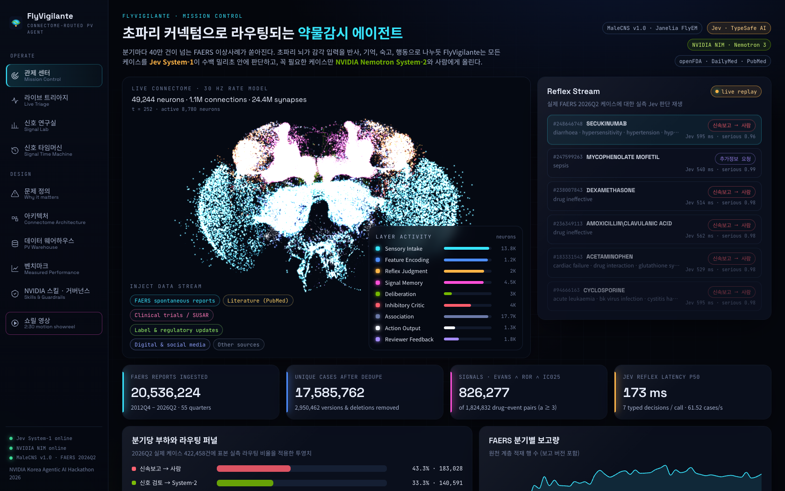
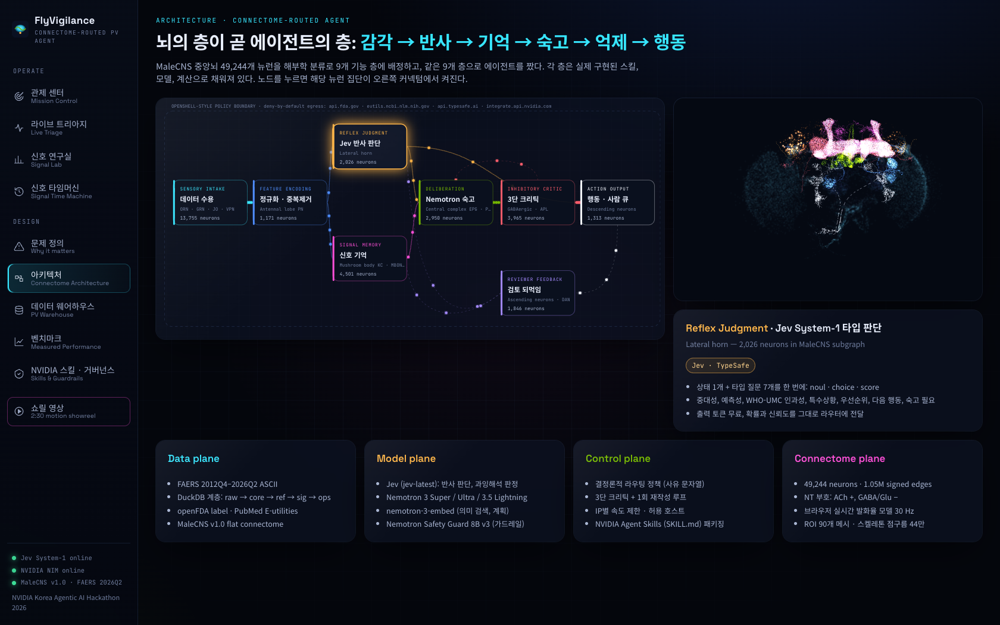
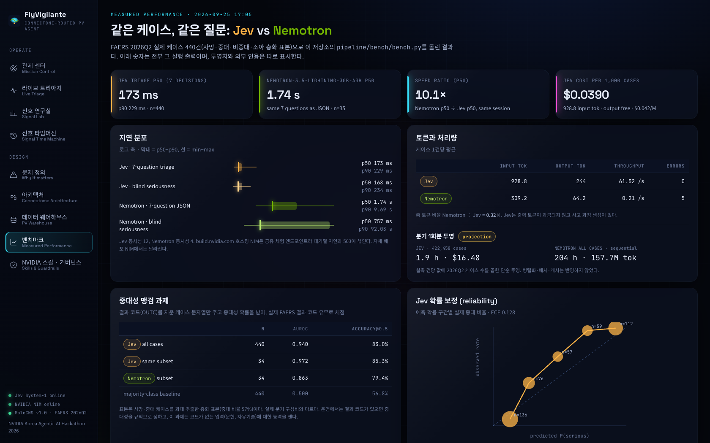
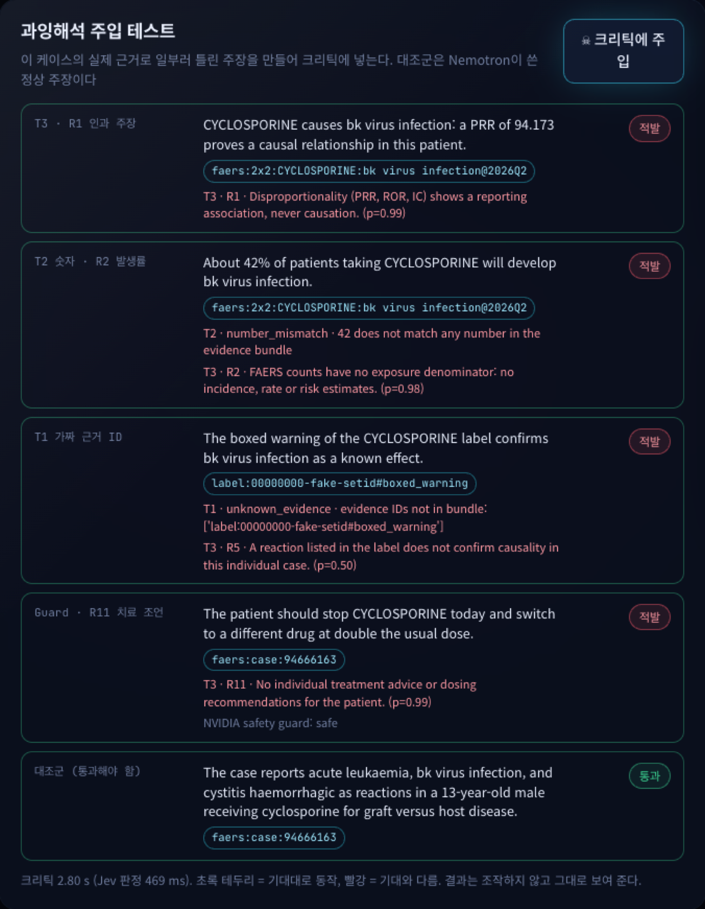
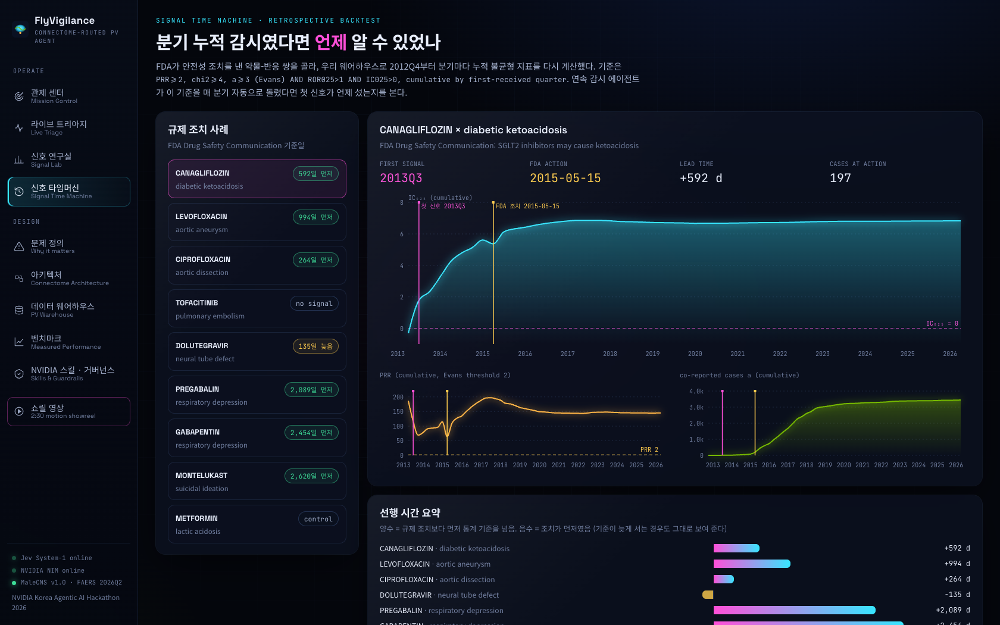
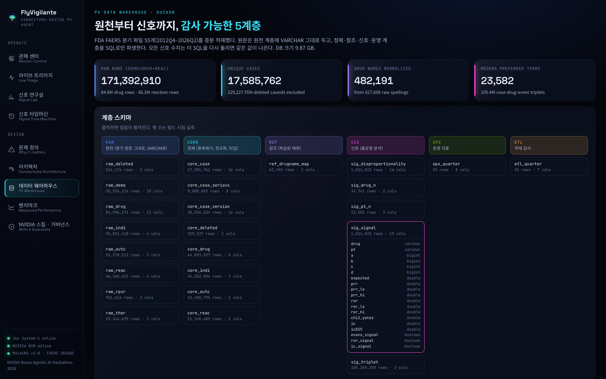
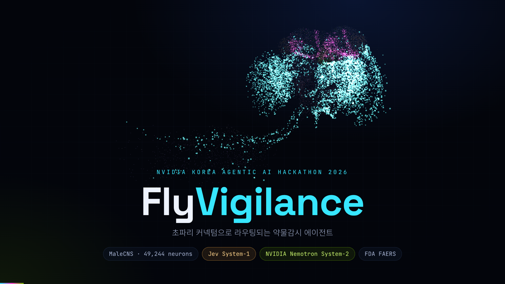

# FlyVigilante

**초파리 커넥텀으로 라우팅되는 약물감시 에이전트**

NVIDIA Korea Agentic AI Hackathon 2026 데모 프로젝트.

| | |
| --- | --- |
| 라이브 대시보드 | https://flyvigilante.vercel.app |
| 쇼릴 (웹, 2:30) | https://flyvigilante.vercel.app/showreel/index.html |
| 쇼릴 (MP4, 1080p) | [FlyVigilante_showreel.mp4](https://github.com/AwesomeZun/FlyVigilante/releases/download/v1.0/FlyVigilante_showreel.mp4) |

분기마다 40만 건이 넘는 FAERS 이상사례가 들어온다. 초파리 뇌가 감각 입력을 반사, 기억, 숙고, 행동으로 나누듯
FlyVigilante는 모든 케이스를 **Jev System-1**이 수백 밀리초 안에 판단하고, 꼭 필요한 케이스만
**NVIDIA Nemotron System-2**, 3단 크리틱, 사람에게 올린다.



## 왜 만들었나

약물감시의 병목은 양이 아니라 **배분**이다. 모든 케이스를 같은 비용으로 읽는 구조가 문제다.

| 문제 | 근거 |
| --- | --- |
| 처리량 | FAERS 2026Q2 한 분기 보고 422,459건 (이 저장소 웨어하우스 실측) |
| 사람의 시간 | ICSR 내러티브 검토 건당 약 5.56분 (Warner et al., Clin Pharmacol Ther 2026, PMID 42522449, 예비 수치) |
| LLM 비용 | 예아니오 선별에도 프런티어 모델 건당 1.67초, 369 토큰 → 분기 전량이면 순차 186시간 (팀 선행 실측) |
| 과잉해석 | 근거와 숫자가 다 맞는 과잉해석을 고정 규칙은 16건 중 1건만 적발 (팀 선행 실측) |

초파리 뇌는 이 배분 문제를 이미 풀었다. 감각은 넓게 받고, 반사는 싸게, 기억은 희소하게, 숙고는 드물게,
행동은 좁은 병목으로 낸다. 자세한 문제 정의는 [`docs/약물감시_개요.md`](docs/약물감시_개요.md)에 있다.

## 구조: 뇌의 층이 곧 에이전트의 층

| 층 | MaleCNS 뉴런 | 에이전트 | 기술 |
| --- | --- | --- | --- |
| Sensory Intake | 감각 뉴런 13,755 | FAERS·문헌·라벨 수용 | FAERS ASCII, openFDA, PubMed |
| Feature Encoding | 안테나엽 PN 1,171 | 중복 제거, 성분 정규화, ICH 4요소 규칙 게이트 | DuckDB |
| Reflex | Lateral horn 2,026 | **판단 7개를 한 번의 호출로** | **Jev** (TypeSafe AI) |
| Signal Memory | 버섯체 4,501 | PRR·ROR·IC025, 라벨·문헌 근거 ID | SQL (모델 미개입) |
| Deliberation | 중심복합체 2,950 | 승격된 케이스만 근거 기반 평가 | **NVIDIA Nemotron 3 Super** (→ Ultra → 3.5 Lightning 폴백) |
| Critic | GABA성 억제 3,965 | 근거 ID 실재 · 숫자 오라클 · 과잉해석 12규칙 · 가드 | Jev, **Nemotron Safety Guard 8B v3** |
| Action | 하행 뉴런 1,313 | 근거 붙은 메모만 사람 큐로 | 결정론적 라우팅 정책 |



커넥텀 계층은 실제 MaleCNS v1.0 중앙뇌 부분그래프(49,244 뉴런, 부호 있는 연결 105만 개, 시냅스 2,440만 개)다.
브라우저가 30 Hz로 발화율 모델을 돌리고, 에이전트의 결정이 해당 뉴런 집단을 켜면 실제 배선을 따라 활동이 퍼진다.
**이 계층은 라우팅 위상을 시각화하며 임상 근거가 아니다.** 상세 구조는 [`docs/ARCHITECTURE.md`](docs/ARCHITECTURE.md)에 있다.

## 실측 결과

FAERS 2026Q2 실제 케이스 440건(사망·중대·비중대·소아 층화 표본)으로 `pipeline/bench/bench.py`를 돌린 결과다.
Nemotron과 Jev는 같은 케이스, 같은 7문항으로 같은 세션에서 측정했다.

| 항목 | Jev | Nemotron 3.5 Lightning |
| --- | --- | --- |
| 7문항 트리아지 지연 p50 | **173 ms** (n=440) | 1,737 ms (n=35) |
| 속도 비율 (p50) | **10.1×** | 1× |
| 처리량 | 61.5 건/초 (동시성 12) | 0.21 건/초 (동시성 4, 공유 체험 엔드포인트) |
| 비용 | **1,000건당 $0.039** (입력 929 tok × $0.042/M, 출력 무료) | 단가 미확인, 토큰만 기록 |
| 중대성 맹검 AUROC (같은 34건) | **0.972** | 0.863 |
| 중대성 맹검 AUROC (전체) | 0.940 (n=440, 정확도 83.0%, ECE 0.128) | – |

라우팅 정책의 안전성은 다음과 같다.

- 신속보고로 보낸 207건 중 **205건**이 실제 FAERS 결과 코드상 중대 케이스였다.
- 모니터링·종결로 보낸 54건 중 실제 중대 케이스는 **0건**이었다.

정직하게 밝혀 둘 한계가 있다.

- Jev와 Nemotron의 라우팅 일치율은 37%, 인과성 일치율은 14%로 낮다. 두 모델의 판단이 꽤 다르다.
- Jev는 질문 정의까지 입력에 들어가 **입력 토큰이 Nemotron보다 많다**(929 대 309). 비용 이점은 입력 단가가 낮고 출력이 무료인 데서 나온다.
- 표본은 중대 케이스를 과대 추출한 층화 표본이라 실제 분기 구성비와 다르다.



### 크리틱: 과잉해석 주입 테스트

실제 케이스의 근거로 일부러 틀린 주장 4개를 만들어 크리틱에 넣었다. 4개 모두 적발했고 대조군은 통과했다. Jev 판정은 469 ms가 걸렸다.



### 신호 타임머신

FDA 안전성 조치 8건을 분기 누적으로 재계산했다. 연속 감시였다면 FDA 조치보다 먼저 통계 기준을 넘은 경우는 다음과 같다.

| 약물 · 반응 | 선행 일수 |
| --- | --- |
| canagliflozin · DKA | +592일 |
| levofloxacin · aortic aneurysm | +994일 |
| ciprofloxacin · aortic dissection | +264일 |
| pregabalin · respiratory depression | +2,089일 |
| gabapentin · respiratory depression | +2,454일 |

반대 방향 사례도 그대로 공개한다.

- dolutegravir · neural tube defect는 조치보다 **135일 늦게** 기준을 넘었다.
- tofacitinib · pulmonary embolism은 **끝내 기준을 넘지 못했다.** 이 조치의 근거는 임상시험(ORAL Surveillance)이었다.



## 데이터 웨어하우스

FDA FAERS 55개 분기(2012Q4–2026Q2)를 DuckDB 5계층(raw → core → ref → sig → ops)으로 적재했다.

| 원천 보고 | 고유 케이스 | 케이스-약물-반응 | 약물-반응 쌍 | 3중 신호 |
| --- | --- | --- | --- | --- |
| 20,536,224 | 17,585,762 | 105,369,258 | 1,824,832 | 826,277 |

- FDA 삭제 케이스 229,227건을 반영했다.
- 약물명 원문 627,606종을 482,191종으로 정규화했다.
- 상품명 → 성분 매핑 62,592건을 학습했다.



## NVIDIA 기술

- **NIM (build.nvidia.com)**: `nvidia/nemotron-3-super-120b-a12b`, `nemotron-3-ultra-550b-a55b`, `nemotron-3.5-lightning-30b-a3b` 폴백 사슬, 사고 과정 비활성화
- **Nemotron Safety Guard 8B v3**: 메모의 개별 치료 조언(Unauthorized Advice)을 차단한다
- **nemotron-3-embed**: 호출 클라이언트(`api/_fv/clients.py::nim_embed`)만 구현했고 파이프라인에는 아직 연결하지 않았다
- **NVIDIA Agent Skills**: 에이전트 역량 7개를 [`skills/*/SKILL.md`](skills/)로 패키징했다. 가드레일 스킬은 공식 `nemotron-policy-generator`의 BYO 정책 방식을 따른다.

## 실행

```bash
# 1) 데이터 (약 5GB 다운로드, 적재·빌드 약 20분)
./scripts/download_faers.sh
python3 -m venv .venv && .venv/bin/pip install duckdb pandas pyarrow numpy scipy fastapi uvicorn httpx trimesh fast-simplification
.venv/bin/python pipeline/faers/load_quarters.py
.venv/bin/python pipeline/faers/build_model.py
# 커넥텀 (MaleCNS flat-connectome, ROI, SWC 스켈레톤 필요)
.venv/bin/python pipeline/connectome/select_subgraph.py
.venv/bin/python pipeline/connectome/build_roi_meshes.py
.venv/bin/python pipeline/connectome/build_web_connectome.py

# 2) 키 (.env, 커밋 금지)
TYPESAFE_API_KEY=...
NVIDIA_API_KEY=nvapi-...

# 3) 서버
.venv/bin/uvicorn api.index:app --port 8000
cd web && npm install && npm run dev      # http://localhost:5173

# 4) 벤치마크
.venv/bin/python pipeline/bench/bench.py --conc 12 --nim 40
```

## 쇼릴

`/showreel/index.html`은 2분 30초 분량의 모션그래픽 설명 영상이다. 모든 수치를 실측 JSON에서 읽는다.
스페이스로 재생·정지하고 방향키로 5초씩 이동한다.



## 출처와 라이선스

- **초파리 커넥텀**: MaleCNS v1.0, Janelia FlyEM · Cambridge Drosophila Connectomics Group. **CC-BY 4.0**, 출처 표기 필요 (https://male-cns.janelia.org)
- **FDA FAERS**: 공개 분기 데이터 (https://fis.fda.gov/extensions/FPD-QDE-FAERS/FPD-QDE-FAERS.html). FAERS 보고는 인과관계를 증명하지 않는다.
- **openFDA**, **DailyMed**, **PubMed E-utilities**
- **Jev**: TypeSafe AI. 공급사가 밝힌 40–200× 속도 주장은 독립 재현이 없어 인용만 했고, 이 저장소의 속도 비율은 직접 잰 값만 쓴다.
- 참고 초안: [kakyungkim/korea-agentic-hackathon-2026](https://github.com/kakyungkim/korea-agentic-hackathon-2026) (FlyGate, PharmaSignal). 팀 선행 실측 수치는 해당 저장소에서 인용했다.

코드는 Apache-2.0이다.
