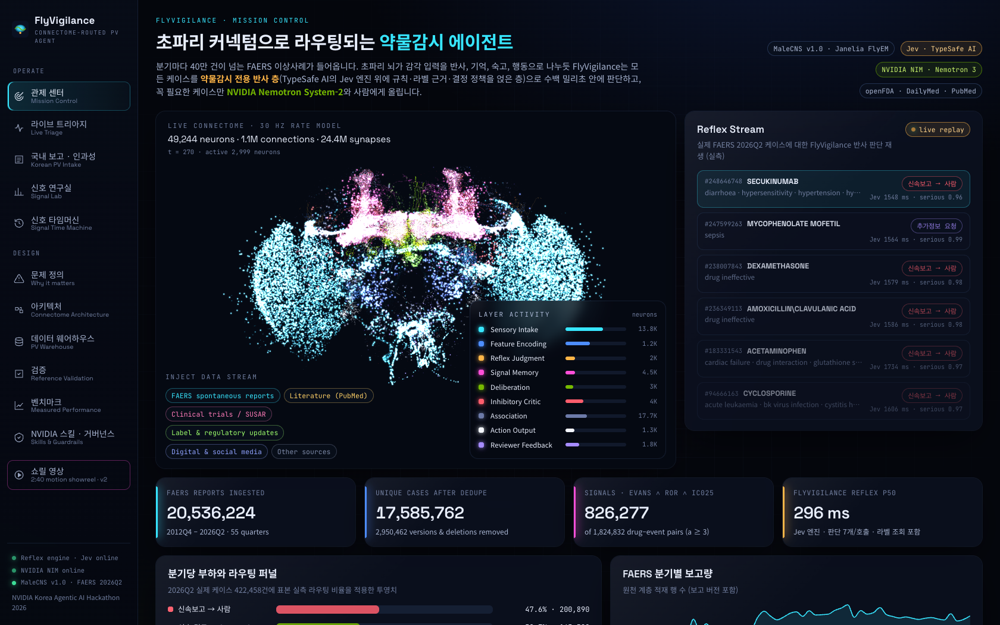
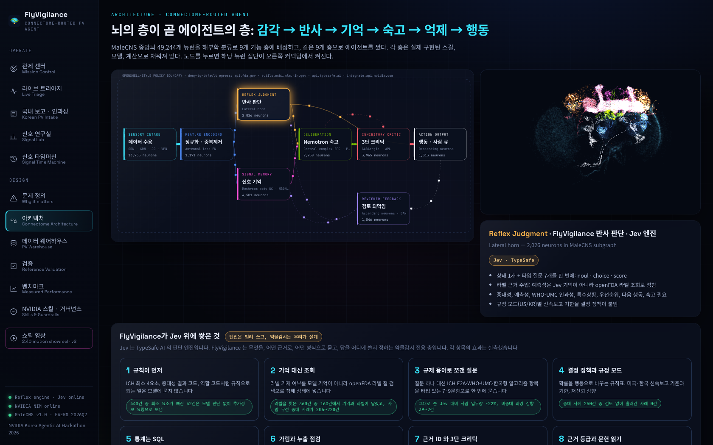
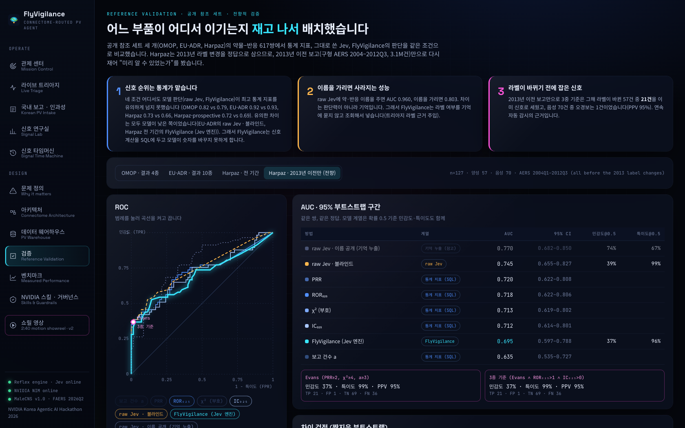
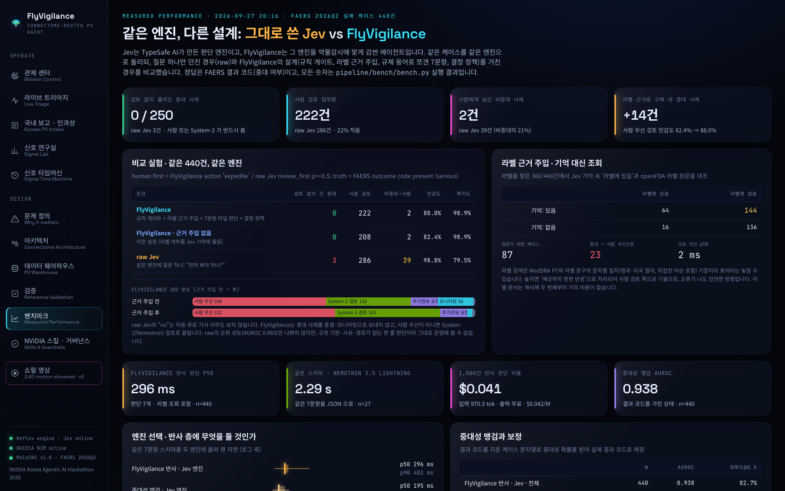
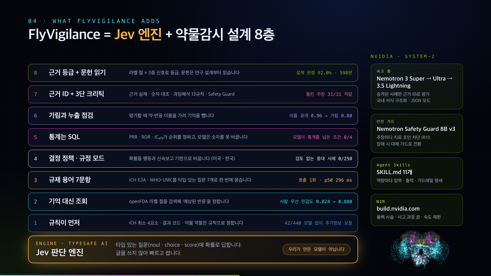

# FlyVigilance

**약물감시에 특화한 Vigilance Agent · 초파리 커넥텀 라우팅 · Jev 판단 엔진 · NVIDIA Nemotron**

NVIDIA Korea Agentic AI Hackathon 2026 데모 프로젝트입니다.

| | |
| --- | --- |
| 라이브 대시보드 | https://flyvigilance.vercel.app |
| 쇼릴 v2.0.0 (웹, 파일 하나로 완결) | https://flyvigilance.vercel.app/showreel/FlyVigilance_showreel_v2.0.0.html |
| 쇼릴 v2.0.0 (MP4, 1080p) | [FlyVigilance_showreel_v2.0.0.mp4](https://github.com/AwesomeZun/FlyVigilance/releases/download/v2.0/FlyVigilance_showreel_v2.0.0.mp4) |
| 평가 보고서 | [docs/EVALUATION.md](docs/EVALUATION.md) |

분기마다 40만 건이 넘는 FAERS 이상사례가 들어옵니다. FlyVigilance는 초파리 뇌가 감각 입력을 반사·기억·숙고·행동으로 나누듯 사례를 배분합니다.
- **반사 층**: 모든 사례를 수백 밀리초 안에 판단합니다.
- **숙고와 검토**: 필요한 사례만 NVIDIA Nemotron 숙고 층, 3단 크리틱, 사람에게 올립니다.

반사 층의 엔진은 TypeSafe AI의 **Jev**입니다. 우리가 만든 모델은 아닙니다. 우리가 만든 것은 그 엔진을 약물감시에 쓸 수 있게 하는 층이고, 그 층이 무엇을 바꾸는지 실측했습니다.



## 한눈에 보는 결과

| 질문 | 결과 | 어디서 |
| --- | --- | --- |
| 그대로 쓴 Jev보다 나은가 | 검토 없이 흘러간 중대 사례 **0/250** (raw 3), 사람 업무량 **222 vs 286 (−22%)**, 비중대 과잉 상향 **2 vs 39** | 실제 FAERS 440건 |
| 기억 대신 조회하면 달라지는가 | 라벨을 찾은 360건 중 **160건**에서 기억이 라벨 원문과 달랐습니다. 조회로 바꾸자 사람 우선으로 올라간 중대 사례가 **206→220건**으로 늘었습니다 | 같은 440건 |
| 신호 순위를 모델에 맡겨도 되는가 | 공개 참조 세트 4조건 어디서도 모델 재순위가 최고 통계 지표를 **유의하게 넘지 못했습니다** → 통계는 SQL이 맡습니다 | OMOP·EU-ADR·Harpaz 617쌍 |
| 라벨이 바뀌기 전에 알 수 있었나 | 2013년 이전 보고만으로 그해 라벨 변경 57건 중 **21건**을 신호로 세웠고, 오경보는 음성 70건 중 **1건**(PPV **0.95**)이었습니다 | 구형 AERS 2004–2012 |
| 문헌 판단을 믿을 수 있나 | 연구 설계 판정이 MEDLINE 색인과 **92.0%** 일치했습니다 | PubMed 598편 |

자세한 방법과 한계는 [docs/EVALUATION.md](docs/EVALUATION.md)에 있습니다.

## 왜 만들었나

약물감시의 병목은 양이 아니라 **배분**입니다. 모든 사례를 같은 비용으로 읽는 구조가 문제입니다.

| 문제 | 근거 |
| --- | --- |
| 처리량 | FAERS 2026Q2 한 분기 보고 422,459건 (이 저장소 웨어하우스 실측) |
| 사람의 시간 | ICSR 내러티브 검토 건당 약 5.56분 (Warner et al., Clin Pharmacol Ther 2026, PMID 42522449, 예비 수치) |
| LLM 비용 | 예아니오 선별에도 프런티어 모델은 건당 1.67초, 369토큰을 씁니다. 분기 전량이면 순차 186시간입니다 (팀 선행 실측) |
| 과잉해석 | 근거와 숫자가 다 맞는 과잉해석을 고정 규칙은 16건 중 1건만 적발했습니다 (팀 선행 실측) |
| 모델 기억 | 약 이름을 보여 주면 모델은 기억으로 답합니다. 이름을 가리면 새 신호 판별이 사라졌습니다 (팀 확장 계획 PDF 5쪽, 이 저장소에서 617쌍으로 재현) |

국내 약물감시 흐름과 문제의식은 [docs/약물감시_개요.md](docs/약물감시_개요.md)에 정리했습니다.

## FlyVigilance가 Jev 엔진 위에 쌓은 것

| # | 설계 | 하는 일 | 실측 효과 |
| --- | --- | --- | --- |
| 1 | 규칙이 먼저 | ICH 최소 4요소, 결과 코드, 약물 역할처럼 규칙으로 되는 일은 모델에 묻지 않습니다 | 440건 중 최소 요소가 빠진 42건은 모델 판단 없이 추가정보 요청으로 보냄 |
| 2 | 기억 대신 조회 | 라벨 기재 여부를 openFDA 라벨 절 검색으로 정해 상태에 넣습니다 | 사람 우선 민감도 0.824→0.880(중대 사례 +14건), 조회 지연 중앙값 1.7ms |
| 3 | 규제 용어로 쪼갠 질문 | ICH E2A·WHO-UMC·한국형 알고리즘 항목을 타입 있는 7~9문항으로 한 번에 묻습니다 | raw 대비 비중대 과잉 상향 39→2건 (4와 함께 잰 값) |
| 4 | 결정 정책과 규정 모드 | 확률을 행동으로 바꾸는 규칙표입니다. 미국·한국 신속보고 기준과 기한을 붙입니다 | 검토 없이 흘러간 중대 사례 3→0건 (250건 중) |
| 5 | 통계는 SQL | PRR·ROR·IC₀₂₅가 신호 순위를 정하고, 모델은 숫자를 바꾸지 못합니다 | 참조 세트 4조건에서 모델 재순위가 통계를 넘지 못함 |
| 6 | 가림과 누출 점검 | 평가할 때 약·반응 이름을 가려 기억이 섞이지 않게 합니다 | OMOP에서 이름 공개 AUC 0.96, 가리면 0.80 |
| 7 | 근거 ID와 3단 크리틱 | 주장마다 근거 ID를 붙이고, 숫자를 대조하며, 과잉해석 13규칙과 NVIDIA Safety Guard를 거칩니다 | 실제 사례 8건에 넣은 틀린 주장 31/31 적발, 정상 대조군 6/6 통과 |
| 8 | 근거 등급과 문헌 읽기 | 라벨 절 + 3중 신호로 등급을 매기고, 문헌은 출판 유형 규칙 + Jev 설계 판정으로 읽습니다 | 설계 판정 92.0%, 팀 시제품의 단서 오귀속 1건 바로잡음 |

## 구조: 뇌의 층이 곧 에이전트의 층

| 층 | MaleCNS 뉴런 | 에이전트 | 기술 |
| --- | --- | --- | --- |
| Sensory Intake | 감각 뉴런 13,755 | FAERS·문헌·라벨·국내 보고 수용 | FAERS ASCII, openFDA, PubMed |
| Feature Encoding | 안테나엽 PN 1,171 | 중복 제거, 성분 정규화, ICH 4요소 규칙 게이트, 국내 서식 구조화 | DuckDB, NVIDIA Nemotron |
| Reflex | Lateral horn 2,026 | 라벨 근거 주입 + 판단 7개를 한 번에 + 결정 정책 | **Jev 엔진** (TypeSafe AI) |
| Signal Memory | 버섯체 4,501 | PRR·ROR·IC₀₂₅, 근거 등급, 문헌 읽기, 참조 세트 성능 | SQL, Jev 엔진 |
| Deliberation | 중심복합체 2,950 | 승격된 사례만 근거 기반 평가 | **NVIDIA Nemotron 3 Super** (→ Ultra → 3.5 Lightning 폴백) |
| Critic | GABA성 억제 3,965 | 근거 ID 실재 · 숫자 오라클 · 과잉해석 13규칙 · 안전 가드 | Jev 엔진, **NVIDIA Nemotron Safety Guard 8B v3** |
| Action | 하행 뉴런 1,313 | 근거 붙은 메모만 사람 큐로, 신속보고 기한 표시 | 결정론적 라우팅 정책 |



커넥텀 계층은 실제 MaleCNS v1.0 중앙뇌 부분그래프입니다(뉴런 49,244개, 부호 있는 연결 105만 개, 시냅스 2,440만 개). 브라우저가 30 Hz로 발화율 모델을 돌리고, 에이전트의 결정이 해당 뉴런 집단을 켜면 실제 배선을 따라 활동이 퍼집니다. **이 계층은 라우팅 위상을 시각화하며 임상 근거가 아닙니다.** 상세 구조는 [docs/ARCHITECTURE.md](docs/ARCHITECTURE.md)에 있습니다.

## 검증



- **참조 세트**: OMOP 387쌍, EU-ADR 93쌍, Harpaz 137쌍에 Harpaz 전향 127쌍을 더해 네 조건을 비교했습니다.
- **비교 방법**: 통계 지표 5종, raw Jev(이름 공개/블라인드), FlyVigilance를 같은 쌍에서 비교했습니다.
- **반응 정의**: Harpaz의 MedDRA 정의를 먼저 쓰고, 없는 결과는 공개 정규식으로 묶었습니다. 기억으로 채우지 않았습니다.
- **해석의 범위**: 참조 세트의 양성은 라벨·문헌에서 나왔습니다. 그래서 이 측정은 "공인된 조합을 가려내는가"를 재며, 개별 사례의 인과성은 재지 않습니다.



### 크리틱: 과잉해석 주입 테스트

실제 사망·중대 사례 8건마다 그 사례의 근거로 일부러 틀린 주장 4종을 만들어 크리틱에 넣었습니다.
- **틀린 주장 4종**: PRR로 인과 단정, 없는 발생률, 가짜 근거 ID, 개별 치료 조언
- **결과**: 31건을 모두 적발했고, Nemotron이 쓴 정상 대조군 6건은 모두 통과했습니다.
- **찾아 고친 결함**: 이 테스트로 결함 세 가지를 찾아 고쳤습니다.
  - Safety Guard가 메모를 이어 붙여 보면 치료 조언을 놓쳐서, 주장마다 따로 검사하도록 바꿨습니다.
  - 가드 엔드포인트 장애에 대비해 대체 가드와 시간 예산을 두었습니다.
  - JSON이 깨진 메모가 "주장 없음"으로 통과하던 구멍을 막았습니다.

자세한 내용은 [평가 보고서 5절](docs/EVALUATION.md#5-크리틱-과잉해석-주입-테스트)에 있습니다.


### 근거 등급

팀 시제품(A~D)을 이어받아 다음 세 가지를 보완했습니다.
- **두 축 분리**: 규제 강도와 통계 근거를 나눴습니다.
- **L 칸 추가**: 라벨에는 있지만 신호가 서지 않는 경우입니다.
- **신호 기준 명시**: Evans ∧ ROR₀₂₅ ∧ IC₀₂₅를 신호로 봅니다.

인과 미확립 단서는 그 반응을 언급한 문장 주변에서만 찾습니다. 그 결과 이소트레티노인–염증성장질환은 C가 아니라 B가 됩니다. 시제품이 인용한 단서는 청력 손상 항목의 문장이었습니다. 대신 이 조합이 논쟁적이라는 점은 문헌 축("분석 연구 결과 혼재")에 나타납니다.

### 신호 타임머신

FDA 안전성 조치 8건을 분기 누적으로 재계산했습니다. 연속 감시였다면 FDA 조치보다 먼저 통계 기준을 넘은 경우는 다음과 같습니다.

| 약물 · 반응 | 선행 일수 |
| --- | --- |
| canagliflozin · DKA | +592일 |
| levofloxacin · aortic aneurysm | +994일 |
| ciprofloxacin · aortic dissection | +264일 |
| pregabalin · respiratory depression | +2,089일 |
| gabapentin · respiratory depression | +2,454일 |

반대 방향의 사례도 그대로 공개합니다.
- **dolutegravir · 신경관 결손**: 조치보다 135일 늦게 기준을 넘었습니다.
- **tofacitinib · 폐색전증**: 끝내 기준을 넘지 못했습니다. 이 조치의 근거는 임상시험(ORAL Surveillance)이었습니다.


## 국내 약물감시 모드

대시보드의 **국내 보고 · 인과성** 화면(`#/korea`)에서 국내 보고를 한 번에 처리합니다.

1. **보고 구조화** (`POST /api/kr/intake`): 의약전문가용 서식, 일반인 보고, 병원·약사 사례 서술을 받습니다.
   - NVIDIA Nemotron이 식약처 공고 제2023-057호 서식의 가~바 섹션을 채우고, 빠진 정보를 추가정보 요청 목록으로 돌려줍니다.
   - 약물 역할·보고자 코드·결과 코드는 서식 값에서 규칙으로 만듭니다.
2. **한국형 인과성 평가 알고리즘 ver 2.0** (`POST /api/kr/causality`)
   - 8개 항목은 Jev 엔진 한 번 호출로 판단하고, 점수와 등급은 규칙으로 계산합니다.
   - "알려진 정보" 항목은 라벨에 있으면 +3, 라벨에 없고 PubMed 증례보고가 있으면 +2를 줍니다(문헌 읽기).
   - 예를 들어 테고프라잔–두드러기는 "The first case of tegoprazan-induced urticaria"(J Clin Pharm Ther 2020)를 찾아 +2를 받았습니다.
3. **국내 규정 모드** (`POST /api/triage?regime=KR`): 같은 판단을 한국과 미국 규정으로 각각 라우팅해 비교합니다.
   - 한국: 중대한 약물이상반응이면 15일 신속보고 대상입니다.
   - 미국: 중대하고 예상하지 못한 사례만 대상입니다.

## 데이터 웨어하우스

FDA FAERS 55개 분기(2012Q4–2026Q2)를 DuckDB 5계층(raw → core → ref → sig → ops)으로 적재했습니다.

| 원천 보고 | 고유 사례 | 사례-약물-반응 | 약물-반응 쌍 | 3중 신호 |
| --- | --- | --- | --- | --- |
| 20,536,224 | 17,585,762 | 105,369,258 | 1,824,832 | 826,277 |

- FDA 삭제 사례 229,227건을 반영했습니다.
- 약물명 원문 627,606종을 482,191종으로 정규화했습니다.
- 상품명→성분 매핑 62,592건을 학습했습니다.
- 전향적 검증용으로 구형 AERS 35개 분기(2004Q1–2012Q3, 고유 사례 3,091,158건)를 별도 DB에 적재했습니다.


## NVIDIA 기술

- **NIM (build.nvidia.com)**
  - `nvidia/nemotron-3-super-120b-a12b` → `nemotron-3-ultra-550b-a55b` → `nemotron-3.5-lightning-30b-a3b` 순서의 폴백 사슬로 씁니다.
  - System-2 평가와 국내 서식 구조화를 맡습니다.
- **Nemotron Safety Guard 8B v3**: 메모 속 개별 치료 조언(Unauthorized Advice)을 막습니다.
- **NVIDIA Agent Skills**: 에이전트 역량 11개를 [skills/*/SKILL.md](skills/)로 패키징했습니다. 가드레일 스킬은 공식 `nemotron-policy-generator`의 BYO 정책 방식을 따릅니다.
- **nemotron-3-embed**: 호출 클라이언트만 구현했고, 파이프라인에는 아직 연결하지 않았습니다.

## 실행

```bash
# 1-A) 빠른 길: 빌드된 FAERS 웨어하우스(DuckDB)와 커넥텀 파생물을 릴리스 data-v1 에서 받습니다
./scripts/fetch_data.sh                     # zstd 필요

# 1-B) 처음부터 재현 (약 8GB 다운로드, 적재·빌드 약 20분)
python3 -m venv .venv && .venv/bin/pip install duckdb pandas pyarrow numpy scipy fastapi uvicorn httpx trimesh fast-simplification pyreadr xlrd pytest
./scripts/download_faers.sh
.venv/bin/python pipeline/faers/load_quarters.py
.venv/bin/python pipeline/faers/build_model.py
./scripts/download_malecns.sh
.venv/bin/python pipeline/connectome/select_subgraph.py
.venv/bin/python pipeline/connectome/build_roi_meshes.py
.venv/bin/python pipeline/connectome/build_web_connectome.py

# 2) 키 (.env, 커밋 금지)
TYPESAFE_API_KEY=...
NVIDIA_API_KEY=nvapi-...

# 3) 서버
.venv/bin/python -m uvicorn api.index:app --port 8000
cd web && npm install && npm run dev      # http://localhost:5173

# 4) 테스트와 평가
.venv/bin/python -m pytest -q tests        # 오프라인 37개
FV_CACHE_DIR=data/cache/api .venv/bin/python pipeline/bench/bench.py --conc 12 --nim 30
./scripts/download_refsets.sh && .venv/bin/python pipeline/refsets/build_refsets.py
./scripts/download_aers_legacy.sh && .venv/bin/python pipeline/refsets/legacy_aers.py
.venv/bin/python pipeline/refsets/evaluate.py
FV_CACHE_DIR=data/cache/api .venv/bin/python pipeline/bench/literature_eval.py
FV_CACHE_DIR=data/cache/api .venv/bin/python pipeline/bench/critic_probe.py --n 8
```

## 쇼릴

`FlyVigilance_showreel_v2.0.0.html`은 2분 40초 분량의 모션그래픽 설명 영상입니다. 파일 하나로 완결되므로 인터넷 없이 어디서 열어도 됩니다. 스페이스로 재생·정지하고, 방향키로 5초씩 이동합니다. 이전 판(v1)은 `showreel/index.html`과 릴리스 v1.0에 그대로 두었습니다.



## 시판 전 탐색 (FlyDiscovery)

같은 후보(니라파립)의 시판 전 단계는 [`fly_discovery/`](fly_discovery/)에 있습니다.
MSA-Search → OpenFold3 → DiffDock → Boltz-2 결과를 전통 기준으로 채점하고, 크리틱 3단으로 근거를 넘는 주장을 반려합니다.

## 출처와 라이선스

- **초파리 커넥텀**: MaleCNS v1.0, Janelia FlyEM · Cambridge Drosophila Connectomics Group. **CC-BY 4.0**, 출처 표기 필요 (https://male-cns.janelia.org)
- **FDA FAERS / AERS**: 공개 분기 데이터 (https://fis.fda.gov/extensions/FPD-QDE-FAERS/FPD-QDE-FAERS.html). 자발 보고는 인과관계를 증명하지 않습니다.
- **참조 세트**
  - OMOP (Ryan et al. 2013)과 EU-ADR (Coloma et al. 2013): OHDSI MethodEvaluation, Apache-2.0
  - Time-indexed reference standard (Harpaz et al. 2014): figshare, CC0
- **openFDA**, **DailyMed**, **PubMed E-utilities**
- **Jev**: TypeSafe AI의 판단 엔진입니다. 공급사가 밝힌 40–200× 속도 주장은 독립 재현이 없어 인용만 했습니다. 이 저장소의 수치는 직접 잰 값만 씁니다.
- **참고 초안**: [kakyungkim/korea-agentic-hackathon-2026](https://github.com/kakyungkim/korea-agentic-hackathon-2026) (FlyGate, PharmaSignal, 근거 등급 시제품, Jev 약물감시 확장 계획). 팀 선행 실측 수치는 해당 저장소에서 인용했습니다.
- **이전 판 문서**: [docs/archive/](docs/archive/)

코드는 Apache-2.0입니다.
