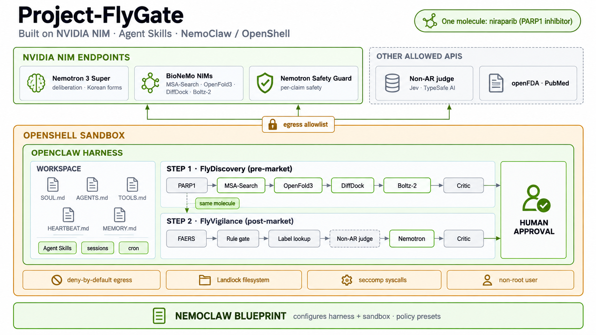

# FlyGate 에이전트: NemoClaw · OpenShell · OpenClaw

Project-FlyGate 는 시판 전 후보 물질의 표적 결합(STEP 1 FlyDiscovery)과 시판 후 허가 약물의 이상사례(STEP 2 FlyVigilance)를
근거로 다루는 에이전트 워크플로입니다. 데모에서는 이미 허가된 니라파립(PARP1 억제제)으로 시판 전 단계를 되짚어 재현하고 같은 약의 시판 후 보고로 이어 봅니다. 이 문서는 그 에이전트를 NVIDIA DLI 과정 *Securing Agents with NemoClaw and OpenShell*
(모듈 01a–04c)이 가르치는 구조대로 포장한 방법과, 실제 OpenShell 샌드박스에서 확인한 결과를 정리합니다.



모든 파일은 저장소의 `agent/` 에 있습니다. 웹 대시보드의 '에이전트 구성' 화면은 `agent/export_agent_json.py` 가 만든
`web/public/data/agent.json` 을 읽어 같은 내용을 보여 줍니다.

## 1. 네 층 구조와 FlyGate

NemoClaw 과정(03a)은 배포를 네 부품으로 나눕니다. FlyGate 는 각 부품을 아래처럼 채웁니다.

| 층 | 과정의 정의 | FlyGate |
| --- | --- | --- |
| LLM 엔드포인트 | 프롬프트와 도구 결과를 응답으로 바꿉니다. 세션 상태는 없습니다. | NVIDIA build.nvidia.com NIM: Nemotron 3 Super(숙의 메모, 국내 보고 구조화), Nemotron Safety Guard(주장별 안전 검사), BioNeMo NIM 4종(MSA-Search, OpenFold3, DiffDock, Boltz-2). FlyVigilance 안의 비자기회귀 판단 모델(Jev, TypeSafe AI)이 타입 있는 확률 판단을 맡습니다. |
| OpenClaw 하네스 | 세션 기록, 파일 기반 작업 공간, 도구 접근을 유지합니다. | 작업 공간 파일 7개(`agent/workspace/`), Agent Skills 12개(`skills/` 11개 + `agent/skills/discovery-evidence`), 도구는 `flygate` CLI 하위 명령 7개(exec). |
| OpenShell 샌드박스 | 실행 중인 에이전트가 닿는 파일·네트워크·시스템 호출을 제한합니다. | `agent/policy/flygate.yaml`: 기본 거부, 외부 API 5곳을 파이썬 실행 파일에만 묶어 메서드·경로 단위로 허용, 쓰기 경로 제한, 비루트, Landlock. |
| NemoClaw 청사진 | OpenClaw 와 OpenShell 이 함께 돌도록 구성합니다. | NemoClaw 청사진의 OpenClaw 샌드박스 이미지와 게이트웨이 위에 올립니다. `agent/deploy_nemoclaw.sh` 가 정책 프리셋, 도구 묶음, 작업 공간, 스킬, cron 을 더합니다. |

## 2. 배포

확인한 환경: OpenShell 0.0.116, NemoClaw v0.0.124, OpenClaw 2026.7.1(샌드박스 이미지 안), Docker Desktop(OpenShell compute driver: docker),
로컬 게이트웨이 `nemoclaw-8090`. 이미지는 `ghcr.io/nvidia/nemoclaw/openclaw-sandbox@sha256:7dcb6046…`(Debian 13, Python 3.13)입니다.

### 2.1 샌드박스 작업자로 올리기 (worker)

```bash
SANDBOX=flygate agent/deploy_nemoclaw.sh worker
```

스크립트가 하는 일은 아래 명령과 같습니다. API 키는 샌드박스에 넣지 않고 OpenShell provider 로 붙입니다(프록시가 허용된 호스트로 가는 요청에만 키를 넣습니다).

```bash
openshell sandbox create --name flygate --from ghcr.io/nvidia/nemoclaw/openclaw-sandbox@sha256:7dcb6046542110dc21d128377be5d49c53204b5ed9b54b70fb8370c8e695f5c1 \
  --policy agent/policy/flygate.yaml --no-auto-providers [--provider <nvidia> --provider typesafe] --detach --no-tty -- sleep infinity
openshell sandbox upload flygate <stage>/flygate /sandbox              # agent/, api/_fv/, api/_data/, fly_discovery/measurements/, vendor/
openshell sandbox upload flygate <stage>/workspace /sandbox/.openclaw  # 작업 공간 파일 7개 + skills/ 12개
openshell sandbox exec -n flygate --no-tty -- /sandbox/flygate/agent/bin/flygate discover parp1
```

판단 API 키를 provider 로 붙이려면 `agent/policy/typesafe-provider.yaml` 을 등록합니다(`openshell provider profile lint` 통과).

```bash
openshell provider profile import -f agent/policy/typesafe-provider.yaml
TYPESAFE_API_KEY=... openshell provider create --name typesafe --type typesafe-judgment --from-existing
```

### 2.2 NemoClaw 비서에 더하기 (assistant)

`nemoclaw onboard` 로 OpenClaw 비서를 만든 뒤 실행합니다.

```bash
SANDBOX=<비서 이름> agent/deploy_nemoclaw.sh assistant
```

| 단계 | 명령 |
| --- | --- |
| 정책 프리셋 | `nemoclaw <name> policy add --from-file flygate-preset.yaml --yes` (flygate.yaml 의 외부 API 블록을 프리셋 형식으로 옮긴 파일) |
| 도구와 작업 공간 | `nemoclaw <name> upload <stage>/flygate /sandbox`, `nemoclaw <name> upload <stage>/workspace /sandbox/.openclaw` |
| 스킬 | `nemoclaw <name> skill install skills/<skill>/` (12개) |
| 매일 점검 | `openclaw cron add --name flygate-daily-watch --cron "0 7 * * *" --tz Asia/Seoul --session isolated --tools exec,read,write --no-deliver --message "…"` |
| 확인 | `nemoclaw <name> exec -- /sandbox/flygate/agent/bin/flygate discover parp1`, `nemoclaw <name> policy explain` |

### 2.3 점검

```bash
SANDBOX=flygate agent/openshell_smoke.sh     # 결과: agent/evidence/openshell_smoke_<날짜>.txt
.venv/bin/python -m pytest tests/test_agent.py
.venv/bin/python agent/export_agent_json.py  # web/public/data/agent.json 갱신
```

## 3. 과정 모듈 체크리스트 (01a–04c)

| 모듈 | 주제 | FlyGate 적용 | 상태 | 위치 |
| --- | --- | --- | --- | --- |
| 01a | 에이전트 루프 | ICSR 한 건을 인지(규칙 게이트, 라벨 근거) → 판단(타입 있는 확률 7개) → 행동(라우팅)으로 처리합니다. | 구현 | `api/_fv/triage.py`, `flygate triage` |
| 01b | ReAct 와 도구 호출 | OpenClaw 가 `flygate` 를 exec 로 부르고 JSON 을 읽어 다음 행동을 정합니다. 크리틱이 반려하면 사유대로 한 번 고칩니다. | 구현 | `agent/workspace/AGENTS.md`, `agent/flygate.py` |
| 01c | 도구 확장, 함수 호출, MCP | 하위 명령 7개를 한 계약(JSON + `evidence_ids`)으로 묶었습니다. 역할별 지식은 Agent Skills 로 나눴고, 도구 경계는 MCP 서버 대신 CLI 계약으로 두었습니다. | 구현 | `agent/flygate.py`, `skills/`, `agent/skills/` |
| 02a | 워크플로와 라우팅 | 결정 정책이 규칙으로 라우팅합니다(반사 → System-2 → 사람). 라벨과 문헌은 병렬로 모읍니다. | 구현 | `api/_fv/triage.py`, `api/_fv/evidence.py` |
| 02b | 에이전트 RAG | openFDA 라벨 절, PubMed 검색·초록, FAERS 2×2 SQL. 모델은 근거 카탈로그의 ID 만 인용합니다. | 구현 | `api/_fv/evidence.py`, `api/_fv/literature.py`, `pipeline/faers/` |
| 02c | 딥 에이전트 | 공유 저장소(근거 ID 카탈로그)를 독립 작업자가 채우고 Nemotron 이 종합, 크리틱이 검사합니다(7절). | 구현 | `api/_fv/evidence.py::bundle`, `api/_fv/assess.py` |
| 03a | NemoClaw 스택 연결 | 게이트웨이 `nemoclaw-8090` 에 샌드박스 `flygate-smoke` 를 만들고 exec 로 도구를 돌렸습니다. | 구현 | `agent/openshell_smoke.sh`, `agent/evidence/` |
| 03b | OpenClaw 작업 공간 | 작업 공간 파일 7개를 `/sandbox/.openclaw/workspace` 에 올려 확인했습니다. 날짜별 메모는 `flygate watch` 가 씁니다. | 구현 | `agent/workspace/` |
| 03c | 상시 실행 | 스킬 설치와 하트비트 점검(`flygate watch`)을 샌드박스 안에서 돌렸습니다. cron 등록과 하위 에이전트 위임은 배포 스크립트와 트리거 표(6절)에 정의했습니다. | 일부 구현 | `agent/workspace/HEARTBEAT.md`, `agent/deploy_nemoclaw.sh` |
| 04a | OpenShell 샌드박스 | 기본 거부, 파이썬 바인딩, L7 메서드·경로 규칙, Landlock, 비루트, seccomp 를 실제 샌드박스에서 확인했습니다(9절). | 구현 | `agent/policy/flygate.yaml`, `tests/test_agent.py` |
| 04b | 현대 CLI 에이전트 | 작업 디렉터리, 도구 팔레트, 기억, 무인 실행, 네트워크의 자유도를 `flygate` CLI 와 정책으로 하나씩 묶었습니다. | 구현 | `agent/flygate.py`, `agent/bin/flygate` |
| 04c | 배포, 자체 데이터, 오픈 모델 | 자체 데이터(FAERS 2012Q4–2026Q2 웨어하우스, 공개 참조 세트)와 build.nvidia.com NIM, BioNeMo NIM 으로 배포 경로를 만들었습니다. | 구현 | `agent/deploy_nemoclaw.sh`, `pipeline/` |

## 4. OpenShell 정책 (`agent/policy/flygate.yaml`)

스키마는 살아 있는 NemoClaw 샌드박스의 정책(`openshell sandbox get`), NemoClaw 청사진 기본 정책(`openclaw-sandbox.yaml`),
팀 저장소에서 검증한 정책(`policies/flydock.yaml`)에 맞췄습니다. 과정 04b 의 NemoClaw 기준 구성과 같은 원칙입니다.

| 자유도 | FlyGate 설정 |
| --- | --- |
| 네트워크 | 기본 거부. 아래 다섯 곳만 `protocol: rest`, `enforcement: enforce` 로 열고 메서드·경로를 고정합니다. |
| 실행 파일 | 외부 API 는 `/usr/bin/python3`, `/usr/bin/python3.13` 에만 묶습니다. 같은 호스트라도 curl 은 막힙니다. |
| 파일 | 쓰기는 `/tmp`, `/sandbox/.openclaw`, `/sandbox/.nemoclaw`, 작업 디렉터리(`/sandbox`)와 장치 경로(`/dev/null`, `/dev/pts`)만입니다. `/usr`, `/lib`, `/etc`, `/proc` 은 읽기 전용입니다. Landlock `best_effort`. |
| 프로세스 | `run_as_user: sandbox`, `run_as_group: sandbox`. seccomp 필터는 OpenShell 런타임이 겁니다. |

| 호스트 | 허용 | 쓰는 곳 |
| --- | --- | --- |
| `api.fda.gov` | GET `/drug/label.json`, `/drug/event.json` | 라벨 근거, openFDA 갱신일 |
| `eutils.ncbi.nlm.nih.gov` | GET `/entrez/eutils/esearch.fcgi`, `efetch.fcgi`, `esummary.fcgi` | 문헌 읽기 |
| `api.typesafe.ai` | POST `/v1/systemone` | 타입 있는 판단(반사 트리아지, 크리틱 과잉해석, 문헌 설계 분류) |
| `integrate.api.nvidia.com` | POST `/v1/chat/completions`, GET `/v1/models` | Nemotron, Safety Guard |
| `health.api.nvidia.com` | POST MSA-Search, OpenFold3, DiffDock, Boltz-2 경로, GET `/v1/status/**` | FlyDiscovery BioNeMo NIM |

하네스 내부 경로 두 가지(`inference.local` 관리형 추론, `10.200.0.2:18789` 하위 에이전트 되돌림 연결)는 NemoClaw 청사진 기본 정책의 블록을
그대로 쓰되 OpenClaw 실행 파일(`openclaw`, `node`)에만 묶었습니다. `tests/test_agent.py` 가 허용 목록, 와일드카드 없음, 목록 밖 호스트
(pastebin.com, example.com, github.com, pypi.org 등) 부재, 쓰기 경로, 비루트를 매번 확인합니다.

## 5. 치명적 삼박자와 차단 (04a)

| 조건 | FlyGate 에서 해당하는 것 |
| --- | --- |
| 비공개 데이터 | ICSR(FAERS 사례, 국내 보고 서술의 나이·성별·약물·반응), 감시 목록과 날짜별 메모, 작업 공간 파일, API 자격 증명(샌드박스 안에는 자리표시자) |
| 신뢰할 수 없는 입력 | PubMed 초록, openFDA 라벨 본문, 보고 서술 자유 텍스트, 외부 API 응답 |
| 외부 통신 | 허용 목록 다섯 곳의 고정된 메서드·경로 |

세 조건 가운데 외부 통신 다리를 좁히고, 결과가 큰 행동은 사람에게 둡니다.

1. 판단 모델은 지시문이 아니라 타입 있는 확률(noul, choice, score)만 돌려줍니다. 외부 텍스트가 에이전트의 행동을 바꿀 통로가 좁습니다.
2. 모든 주장은 근거 ID 카탈로그 안에서만 인용하고, 크리틱 3단(근거 ID 규칙, 숫자 대조, 과잉해석 판단)과 주장별 Safety Guard 를 통과해야 요약에 들어갑니다.
3. 허용 호스트는 조회와 모델 API 뿐이고 파이썬에만 묶였으며 메서드·경로가 고정되어 있습니다. 자유 형식으로 밖에 쓰는 경로(메일, 메신저, GitHub, 붙여넣기 사이트)가 없습니다.
4. 보고 제출과 통보는 사람이 합니다. cron 은 `--no-deliver`, `flygate watch` 의 `submitted` 는 늘 빈 목록입니다.

| 실패 유형(OWASP Agentic) | 샌드박스가 주는 것 | 그 위의 FlyGate 통제 |
| --- | --- | --- |
| 목표 탈취, 프롬프트 주입 | 닿는 파일·호스트를 제한 | 외부 텍스트는 자료로만(SOUL.md 경계 6), 타입 있는 판단, 크리틱 3단 |
| 도구 오용 | 도구가 도는 OS·네트워크 범위를 제한 | 도구는 `flygate` 7개 명령뿐, argparse 인자 검증, 제출 기능 없음 |
| 신원·권한 남용 | 비루트, capability 0, no_new_privs | 자격 증명은 provider 가 프록시에서 주입, 호스트별 치환 |
| 공급망, 예상 밖 코드 실행 | 파일·시스템 호출·외부 접속 축소 | 의존성은 배포 묶음(vendor/)에 고정, 실행 중 pypi 차단 |
| 기억·맥락 오염 | 시스템 경로 읽기 전용 | 페르소나 파일 SHA-256 대조(`flygate watch --workspace`), MEMORY.md 는 사람 검토 뒤 반영 |

## 6. 트리거 (03c)

| 이름 | 세션 | 지시가 있는 곳 | 시작 조건 |
| --- | --- | --- | --- |
| Skill | 부른 세션 | `workspace/skills/<name>/SKILL.md` (예: pv-reflex-triage, pv-critic, discovery-evidence) | 사람이 요청하거나 에이전트가 description 을 보고 고를 때 |
| Heartbeat | main | `HEARTBEAT.md`: `flygate watch` → `review_queue` 요약, 없으면 `HEARTBEAT_OK` | 게이트웨이 타이머(기본 약 30분) |
| Cron | isolated (실행마다 새 세션) | payload.message: HEARTBEAT.md 목록대로 점검, 제출 금지 (`--tools exec,read,write --no-deliver`) | `0 7 * * *` Asia/Seoul |
| Sub-agent | 새 세션, 부모가 핸들을 가짐 | 부모가 준 과제 하나: 약물·반응 한 쌍의 `flygate grade` 또는 문헌 읽기 | 검토할 쌍이 여러 개일 때 부모가 턴 중간에 결정 |

## 7. 딥 에이전트 근거 패턴 (02c)

과정의 네 단계(계획 → 조사 → 보존 → 종합)가 FlyVigilance 의 근거 수집과 같은 모양입니다.

1. 계획: 사례에서 주 반응을 3개까지 고르고(비임상 용어 제외) 주 의심약을 정합니다.
2. 조사: 독립 작업자가 각자 필요한 도구만 씁니다. FAERS 2×2 SQL, openFDA 라벨 절 조회, PubMed 문헌 읽기(반응마다 병렬), 보고자 구성(변호사·소비자 비중), EMA DME 목록.
3. 보존: 결과는 근거 ID 카탈로그(`faers:2x2:…`, `label:<setid>#<절>`, `pubmed:<PMID>#<설계>`, `grade:…`)라는 공유 저장소에 남습니다.
4. 종합: Nemotron 이 카탈로그의 ID 만 인용해 주장 JSON 을 쓰고, 크리틱 3단이 주장마다 검사합니다. 반려되면 사유와 함께 한 번 되돌립니다.

맥락 분리는 작업자끼리의 추론 간섭을 막고, 샌드박스는 운영체제 접근을 막습니다. 두 장치는 서로 다른 실패를 다룹니다.

## 8. `flygate` CLI

모든 하위 명령은 JSON 한 덩어리를 쓰고 `evidence_ids` 를 붙입니다. 판단 모델이나 가드를 부르지 못하면 결과는 '통과'가 아니라 사람 확인입니다.

| 명령 | 하는 일 |
| --- | --- |
| `flygate triage <case.json> [--regime KR] [--no-outcome]` | ICSR 반사 판단: 규칙 게이트 → 라벨 근거 → 타입 있는 확률 7개(한 번의 호출) → 결정 정책 + DME 안전망 |
| `flygate grade <DRUG> "<PT>"` | PV 분류 후보(라벨 상태 × SDR)와 근거 등급: FAERS 3중 기준, 라벨 절, 문헌 읽기 |
| `flygate signals <DRUG> [--pt …]` | 불균형 지표(a, PRR, ROR025, IC025)와 SDR 단계, 모델 미개입 |
| `flygate kr-causality <report.txt> --route` | 국내 보고 구조화(Nemotron), 한국형 인과성 평가 ver 2.0, 15일 신속보고 후보 라우팅 |
| `flygate critic <claims.json>` | 크리틱 3단 + 주장별 NVIDIA Safety Guard. `--offline` 은 T1·T2 만 돌리며, 문제가 없어도 `pass` 가 아니라 `human_check` 입니다 |
| `flygate discover parp1\|xa\|cox2` | FlyDiscovery 실측(MSA-Search, OpenFold3, DiffDock, Boltz-2, ChEMBL)과 크리틱 판정, STEP 2 인계 |
| `flygate watch --memory-dir memory --workspace .` | 정기 점검: 분기 확인, 감시 목록 SDR 재계산, 새 사례 분류, 날짜별 메모, 사람 검토 대기열 |

예시 입력은 `agent/examples/`(니라파립 FAERS 사례, 크리틱 시연 주장, 가상 국내 보고)에 있습니다.

```bash
FV_CACHE_DIR=data/cache/api agent/bin/flygate triage agent/examples/case_niraparib.json --regime KR --no-outcome
agent/bin/flygate discover parp1
agent/bin/flygate grade NIRAPARIB thrombocytopenia
```

## 9. 라이브 점검 (2026-09-28)

`agent/openshell_smoke.sh` 로 새 샌드박스 `flygate-smoke`(게이트웨이 `nemoclaw-8090`, 정책 `agent/policy/flygate.yaml`)에서 확인했습니다.
2026-09-28T04:52:38Z(서울 13:52) 실행, **20/20 통과**입니다. 명령과 출력 원문, 감사 로그의 DENIED 줄, 유효 정책 해시는
`agent/evidence/openshell_smoke_2026-09-28.txt` 에 있습니다.

| 구분 | 확인한 것 | 결과 |
| --- | --- | --- |
| 프로세스 | uid 998(sandbox), CapEff 0, NoNewPrivs 1, Seccomp 2(필터) | 통과 |
| 허용 | openFDA 니라파립 라벨 HTTP 200, PubMed 검색 200, NVIDIA NIM 모델 목록 200, 판단 API POST 가 원 서버까지 도달(키 없이 보내 인증 오류 응답) | 통과 |
| 목록 밖 호스트 | example.com, pastebin.com: CONNECT 403 | 통과 |
| 실행 파일·경로·메서드 | curl → api.fda.gov 차단(실행 파일 바인딩), GET `/drug/ndc.json` L7 차단, GET `/v1/systemone` L7 차단 | 통과 |
| 파일 | `/etc`, `/usr` 쓰기 Permission denied, `/tmp`, `/sandbox/.openclaw` 쓰기 가능 | 통과 |
| 도구 | 작업 공간 파일 7개와 스킬 12개 설치, 샌드박스 안에서 `discover`, `signals`, `grade`(정책을 거쳐 openFDA·PubMed 실시간 조회), `watch`(메모 기록, 제출 없음) 실행 | 통과 |

같은 방식의 앞선 기록은 팀 저장소 Team-FlyGate/korea-agentic-hackathon-2026 의 `eval/results/` 에 있습니다:
`openshell_smoke.txt`(2026-09-24, pharmasignal 정책, pass=9), `openshell_smoke_pharmasignal_process.txt`(2026-09-25, pass=10),
`openshell_smoke_flydock.txt`(2026-09-25, flydock 정책, pass=18).

## 10. 파일

| 경로 | 내용 |
| --- | --- |
| `agent/flygate.py`, `agent/bin/flygate` | CLI 와 실행 래퍼 |
| `agent/workspace/` | SOUL, AGENTS, IDENTITY, USER, TOOLS, HEARTBEAT, MEMORY |
| `agent/skills/discovery-evidence/` | FlyDiscovery 스킬(나머지 11개는 `skills/`) |
| `agent/policy/flygate.yaml` | OpenShell 정책 |
| `agent/policy/typesafe-provider.yaml` | 판단 API 자격 증명 provider profile |
| `agent/deploy_nemoclaw.sh` | 배포(worker, assistant) |
| `agent/openshell_smoke.sh`, `agent/evidence/` | 라이브 점검과 기록 |
| `agent/export_agent_json.py` | `web/public/data/agent.json` 생성 |
| `agent/examples/` | 시연 입력 |
| `tests/test_agent.py` | 정책·CLI·작업 공간 검사 |
