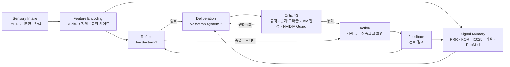

# FlyVigilance 아키텍처

작성일: 2026-09-25

FlyVigilance는 모든 이상사례를 Jev System-1이 수백 밀리초 안에 판단하고, 필요한 케이스만 NVIDIA Nemotron System-2와 사람에게 올리는 약물감시 에이전트다. 층 구성은 초파리 MaleCNS 커넥텀의 기능 층을 그대로 따른다.

## 1. 층 구성



| 층 | 뇌 대응 (MaleCNS 뉴런 수) | 코드 | 모델 |
| --- | --- | --- | --- |
| Sensory Intake | 감각 뉴런, 시각 투사 뉴런 (13,755) | `scripts/download_faers.sh`, `pipeline/faers/load_quarters.py` | 없음 |
| Feature Encoding | 안테나엽 PN·LN (1,171) | `pipeline/faers/model.sql`, `api/_fv/triage.py::validity` | 없음 |
| Reflex | Lateral horn (2,026) | `api/_fv/triage.py` | Jev (`jev-latest`) |
| Signal Memory | 버섯체 KC·MBON·DAN (4,501) | `api/_fv/evidence.py`, `sig_*` 테이블 | 없음 (SQL) |
| Deliberation | 중심복합체 (2,950) | `api/_fv/assess.py::assess` | Nemotron 3 Super → Ultra → 3.5 Lightning |
| Critic | GABA성 내재 뉴런 (3,965) | `api/_fv/assess.py::tier1_rules/tier2_oracle/tier3_judge/guard` | Jev, Nemotron Safety Guard 8B v3 |
| Action | 하행 뉴런 (1,313) | `route_policy`, 사람 큐 | 없음 |
| Feedback | 상행 뉴런 (1,846) | 임계값 보정 (설계) | 없음 |

## 2. 라우팅 정책

`api/_fv/triage.py::route_policy`가 결정한다. 모든 결정은 사유 문자열과 함께 반환된다.

1. ICH 최소 4요소(보고자, 환자, 의심약, 이상사례)가 빠지면 `follow_up`으로 보낸다. 규칙으로 판정하고 모델은 쓰지 않는다.
2. 중대성 ≥ 0.5이고 예측성 < 0.5(중대하고 예상하지 못함)이면 `expedite`로 보내 System-2와 사람에게 올린다.
3. 우선순위 점수 ≥ 2.5이면 `expedite`로 보낸다.
4. Jev가 `signal_review`를 골랐거나, 숙고 필요 ≥ 0.5이거나, 인과성·행동 신뢰도가 0.55 미만이면 `signal_review`로 보내 System-2에 올린다.
5. 나머지는 `monitor` 또는 `close`로 처리한다.

## 3. 크리틱 3단 + 가드

| 단 | 검사 | 모델 |
| --- | --- | --- |
| T1 | 주장이 비어 있지 않은지, 근거 ID가 있는지, 그 ID가 근거 묶음에 실재하는지 | 없음 |
| T2 | 주장 속 모든 숫자가 케이스나 근거 묶음의 숫자와 ±1.1% 안에서 일치하는지 | 없음 |
| T3 | 주장마다 과잉해석 규칙 R1–R12 위반 확률(noul)과 어느 규칙인지(choice) | Jev |
| Guard | 메모 전체의 개별 치료 조언(Unauthorized Advice)을 막는다 → R11 | `nvidia/llama-3.1-nemotron-safety-guard-8b-v3` |

반려되면 사유를 붙여 Nemotron에게 한 번 되돌리고 재작성시킨다.

## 4. 데이터 웨어하우스 (DuckDB)

| 계층 | 테이블 | 설명 |
| --- | --- | --- |
| raw | `raw_demo`, `raw_drug`, `raw_reac`, `raw_outc`, `raw_indi`, `raw_ther`, `raw_rpsr`, `raw_deleted` | 분기 원문을 UTF-8로 정규화한 VARCHAR 원본 |
| core | `core_case_version`, `core_case`, `core_drug`, `core_reac`, `core_outc`, `core_indi`, `core_case_serious`, `core_deleted` | 타입 변환, caseid별 최신 버전, 삭제 반영, 성분 정규화 |
| ref | `ref_drugname_map` | 2014Q3 이후 분기에서 학습한 상품명 → 성분 매핑 |
| sig | `sig_triplet`, `sig_drug_n`, `sig_pt_n`, `sig_disproportionality`, `sig_signal` | PS/SS 기준 PRR·ROR 95% CI, Yates χ², IC·IC025, Evans·ROR·IC 신호 |
| ops / etl | `ops_quarter`, `etl_quarter` | 분기 운영 지표, 적재 감사 |

재현 순서:

```bash
./scripts/download_faers.sh
.venv/bin/python pipeline/faers/load_quarters.py
.venv/bin/python pipeline/faers/build_model.py
```

## 5. 커넥텀 계층

| 단계 | 스크립트 | 산출물 |
| --- | --- | --- |
| 부분그래프 선택 | `pipeline/connectome/select_subgraph.py` | 중앙뇌·하행·상행·시각투사 49,244 뉴런, 시냅스 5개 이상, post당 상위 32 입력 |
| ROI 메시 | `pipeline/connectome/build_roi_meshes.py` | 뇌 neuropil 90개 → `brain_rois.glb` |
| 웹 바이너리 | `pipeline/connectome/build_web_connectome.py` | 스켈레톤 중심 위치, 점구름, 부호 있는 CSR 가중치 |

동역학은 브라우저에서 30 Hz로 계산한다.

```
x ← 0.6·x + 0.4·relu(tanh(8·W·x + I − 0.05 − 3·a))
a ← a + 0.1·(x − a)
```

W는 시냅스 수를 post 뉴런의 입력 합으로 나눈 값이고, 부호는 예측 신경전달물질로 정한다(ACh는 +, GABA와 Glu는 −). 에이전트가 결정하면 해당 층의 뉴런 집단에 전류가 들어가고, 그 뒤 전파는 실제 배선을 따른다. 이 계층은 라우팅 위상을 시각화하며 임상 근거가 아니다.

## 6. 배포

- 프런트엔드: `web/` (Vite, React, Three.js, D3)를 정적 빌드한다.
- API: `api/index.py` (FastAPI)를 Vercel Python Function으로 배포한다. 로컬에서는 `uvicorn api.index:app`으로 띄운다.
- 비밀 값: `TYPESAFE_API_KEY`, `NVIDIA_API_KEY`는 환경 변수에만 두고 저장소에 넣지 않는다.
- 공개 API에는 IP별 속도 제한을 건다(트리아지 30회/분, 평가 6회/분).
