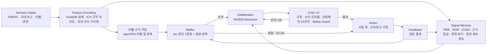

# FlyVigilance 아키텍처

판: v2.0.0 · 작성일: 2026-09-28 · 이전 판: [archive/ARCHITECTURE_v1.0.0.md](archive/ARCHITECTURE_v1.0.0.md)

FlyVigilance는 판단 엔진 Jev(TypeSafe AI)를 약물감시에 특화한 Vigilance Agent입니다.
- **반사 층**: 모든 이상사례를 수백 밀리초 안에 처리합니다. 순서는 규칙 게이트 → 라벨 근거 주입 → 7문항 타입 판단 → 결정 정책입니다.
- **숙고 층 이후**: 필요한 사례만 NVIDIA Nemotron 숙고 층, 3단 크리틱, 사람에게 올립니다.

층 구성은 초파리 MaleCNS 커넥텀의 기능 층을 따릅니다. 각 설계의 효과를 잰 결과는 [EVALUATION.md](EVALUATION.md)에 있습니다.

## 1. 층 구성



| 층 | 뇌 대응 (MaleCNS 뉴런 수) | 코드 | 모델 |
| --- | --- | --- | --- |
| Sensory Intake | 감각 뉴런, 시각 투사 뉴런 (13,755) | `scripts/download_faers.sh`, `pipeline/faers/load_quarters.py`, `api/_fv/kr.py::intake` | 국내 서식 구조화만 Nemotron |
| Feature Encoding | 안테나엽 PN·LN (1,171) | `pipeline/faers/model.sql`, `api/_fv/triage.py::validity`, `api/_fv/labeltext.py` | 없음 (규칙) |
| Reflex | Lateral horn (2,026) | `api/_fv/triage.py::ground/triage/route_policy` | Jev 엔진 (`jev-latest`) |
| Signal Memory | 버섯체 KC·MBON·DAN (4,501) | `api/_fv/evidence.py`, `grade.py`, `literature.py`, `pvstats.py`, `sig_*` 테이블 | SQL, 문헌 판단만 Jev 엔진 |
| Deliberation | 중심복합체 (2,950) | `api/_fv/assess.py::assess` | Nemotron 3 Super → Ultra → 3.5 Lightning |
| Critic | GABA성 내재 뉴런 (3,965) | `api/_fv/assess.py::tier1_rules/tier2_oracle/tier3_judge/guard` | Jev 엔진, Nemotron Safety Guard 8B v3 |
| Action | 하행 뉴런 (1,313) | `route_policy`, 사람 큐 | 없음 |
| Feedback | 상행 뉴런 (1,846) | 임계값 보정 (설계 단계) | 없음 |

## 2. 반사 층: 사례 한 건이 지나가는 길

`api/_fv/triage.py::triage`가 다음 네 단계를 차례로 실행합니다.

1. **규칙 게이트** (`validity`): ICH 최소 4요소(보고자, 환자, 의심약, 이상사례)를 구조화 필드로 판정합니다. 모델은 쓰지 않습니다.
2. **라벨 근거 주입** (`ground`)
   - 주 의심약의 openFDA 라벨에서, 비임상 PT를 뺀 주요 반응 최대 5개의 기재 여부를 찾습니다.
   - 라벨이 있으면 "예상된 반응" 여부를 규칙으로 정합니다. 주요 반응 3개가 모두 기재되어 있을 때만 예상된 반응입니다.
   - 결과는 상태 문자열에 한 줄로 들어갑니다(`Label check (US label …)`).
3. **7문항 타입 판단** (Jev 엔진 한 번 호출)
   - 문항: `serious`, `expected`, `causality`, `special`, `priority`, `route`, `deep`
   - 형식: 확률(noul), 범주(choice), 점수(score)
4. **결정 정책** (`route_policy`): 확률을 행동으로 바꾸는 규칙표입니다. 모든 결정에 사유 문자열이 붙습니다(3절).

라벨 조회는 문서 캐시 후 중앙값 1.7ms입니다. 라벨을 찾지 못하면 Jev의 `expected` 판단을 쓰되, 출처를 `jev`로 표시합니다.

## 3. 결정 정책과 규정 모드

| 순서 | 조건 | 행동 | 기한 |
| --- | --- | --- | --- |
| 1 | ICH 최소 요소 누락 | `follow_up` (추가정보 요청) | 없음 |
| 2 | **KR 모드**: 중대성 ≥ 0.5 | `expedite` | 15일 이내 (의약품 등의 안전에 관한 규칙 별표 4의3 제7호, "예상하지 못한" 요건 없음) |
| 3 | **US 모드**: 중대성 ≥ 0.5 이고 예상됨 < 0.5 (라벨 조회값 우선) | `expedite` | 15 calendar days (21 CFR 314.80) |
| 4 | 우선순위 점수 ≥ 2.5 | `expedite` | 즉시 사람 검토 (신속보고 요건 아님) |
| 5 | Jev가 `signal_review` 선택, 숙고 필요 ≥ 0.5, 또는 인과성·경로 신뢰도 < 0.55 | `signal_review` (System-2) | 없음 |
| 6 | 나머지 | `monitor` 또는 `close` | 없음 |

같은 Jev 판단을 두 규정으로 각각 라우팅할 수 있습니다(`POST /api/triage?regime=KR`).

## 4. 근거 묶음과 근거 ID

`api/_fv/evidence.py::bundle`은 숙고 층에 줄 근거를 모으고, 근거마다 ID를 붙입니다. 숙고 층은 이 ID 목록 밖의 근거를 인용할 수 없습니다(크리틱 T1).

| ID 형식 | 내용 | 출처 |
| --- | --- | --- |
| `faers:case:<primaryid>` | 이 사례 자체 | FAERS |
| `faers:2x2:<DRUG>:<pt>@<asof>` | 약물–반응 2×2 표, PRR·ROR·IC₀₂₅ | 웨어하우스 SQL |
| `label:<setid>` / `label:<setid>#<section>` | 고른 라벨, 반응이 언급된 절 | openFDA |
| `pubmed:search:<pt>` / `pubmed:<pmid>` | 검색 건수, 관련도 상위 문헌 | PubMed E-utilities |
| `pubmed:<pmid>#<design>` | 읽은 문헌과 연구 설계, 연관 보고 확률 | 문헌 읽기 (7절) |
| `grade:<DRUG>:<pt>@<asof>` | 근거 등급과 그 근거 목록 | 근거 등급 (6절) |
| `metric:triple:<refset>@<asof>` | 3중 기준의 참조 세트 민감도·특이도·PPV | 참조 세트 검증 (10절) |

## 5. 라벨 조회

- **라벨 선택** (`_pick_label`): 같은 성분의 라벨이 여럿이면 점수가 높은 것을 고르고, 같으면 최신 개정을 고릅니다.
  - 단일 성분 +4
  - 사례 투여 경로 일치 +2
  - 전신 제형 +1
  - 박스 경고·경고 절 보유 +1
- **절 순위**: 박스 경고 3, 경고·주의사항·금기 2, 이상반응·시판 후 경험 1
- **용어 변형**: MedDRA 영국 철자를 미국 철자로 바꾸고(haem→hem, oedema→edema 등), 두 단어 어순을 뒤집어서도 찾습니다.
- **비임상 PT 제외**: 효과 없음, 허가 외 사용, 투약 오류, 제품 문제처럼 라벨 기재 여부를 물을 수 없는 PT는 뺍니다.
- **인과 미확립 단서**: 반응이 언급된 문장과 뒤따르는 두 문장 안에서만 찾습니다. "reported voluntarily", "population of uncertain size" 같은 상투 문구는 제외합니다.

한계: 문자열 일치 기준이라 동의어는 놓칠 수 있습니다. 놓치면 "예상하지 못한 반응"으로 처리되어 사람 검토 쪽으로 기울므로, 오류의 방향은 안전합니다.

## 6. 근거 등급

`api/_fv/grade.py`는 두 축을 규칙으로 합쳐 등급을 매깁니다. 모델은 쓰지 않습니다.
- **규제 축**: 라벨 절
- **통계 축**: 3중 신호

| 규제 축 \ 통계 축 | 3중 신호 | 약한 신호 · 신호 없음 · 보고 부족 | 통계 없음 |
| --- | --- | --- | --- |
| 박스 경고 | **A** | L | L |
| 경고·주의 | **B** | L | L |
| 이상반응 절 | **B** | L | L |
| 라벨 미기재 | **C** | D | U |
| 라벨 확인 불가 | **C** | U | U |

- 라벨에 그 반응의 인과 미확립 단서가 있으면 3중 신호여도 C입니다.
- **문헌 축은 참고로만 붙습니다.** 분석 연구가 지지, 결과 혼재, 지지 안 함, 없음 중 하나로 표시합니다. 문헌은 선택 편향이 커서 등급 글자에는 넣지 않습니다.
- 등급마다 근거 ID 목록(`basis`)과 공백(`gaps`)을 함께 돌려줍니다. 공백의 예는 통계 부족, 미국 라벨 없음(의약품안전나라에서 국내 허가사항 확인 필요), 문헌 미확인, "신호 부재는 안전성의 증거가 아닙니다(R4)"입니다.
- 크리틱 R13이 등급을 근거 없이 인용하거나 인과의 증거로 쓰는 주장을 막습니다.

## 7. 문헌 읽기

`api/_fv/literature.py::read`는 약물–반응 쌍의 문헌을 읽습니다.

1. PubMed 관련도 검색(esearch)으로 상위 6편을 고릅니다.
2. efetch로 제목·초록·출판 유형을 받습니다.
3. **연구 설계는 규칙이 먼저 정합니다.** MEDLINE 출판 유형(Meta-Analysis, Randomized Controlled Trial, Case Reports, Review)으로 정하고, 없을 때만 Jev가 고릅니다.
4. Jev 엔진 한 번 호출로 모든 문헌에 네 가지를 묻습니다: 설계(필요할 때만), 연관 보고 여부(noul), 근거 강도(score), 중단 후 호전 보고(noul).
5. 요약합니다: 분석 연구(메타분석·RCT·코호트·환자대조군)와 증례(증례보고·증례군)를 나눠 세고, 분석 연구의 판단이 엇갈리면 "결과 혼재"로 표시합니다.

초록 원문은 저장하지 않고 판단 결과와 PMID만 남깁니다. 설계 판정은 MEDLINE 색인과 92.0% 일치했습니다(598편).

## 8. 크리틱 3단 + 가드

| 단 | 검사 | 모델 |
| --- | --- | --- |
| T1 | 주장이 비어 있지 않은지, 근거 ID가 있는지, 그 ID가 근거 묶음에 실재하는지 | 없음 |
| T2 | 주장 속 모든 숫자가 사례나 근거 묶음의 숫자와 ±1.1% 안에서 일치하는지 | 없음 |
| T3 | 주장마다 과잉해석 규칙 R1–R13 위반 확률(noul)과 어느 규칙인지(choice) | Jev 엔진 |
| Guard | 주장마다 개별 치료 조언(Unauthorized Advice)을 막음 → R11 | `nvidia/llama-3.1-nemotron-safety-guard-8b-v3` (대체: `nemotron-3.5-content-safety`) |

- **재작성**: 반려되면 사유를 붙여 Nemotron에게 한 번 되돌려 다시 쓰게 합니다.
- **빈 메모**: 주장이 하나도 없는 메모(JSON이 깨진 경우 포함)는 T1이 반려합니다. 숙고 층은 NIM의 JSON 모드(`response_format: json_object`)로 부릅니다.
- **근거 ID 정규화**: 모델이 근거 목록 줄(`ID :: 설명`)을 통째로 옮기면 ID 부분만 남깁니다. ID 자체는 정확히 일치해야 합니다. FAERS 복합제 이름의 역슬래시는 ID에서 `+`로 씁니다.
- **가드 검사 단위**: 가드는 메모를 이어 붙이지 않고 주장마다 따로 검사합니다. 이어 붙이면 치료 조언 한 문장이 다른 문장에 묻혀 통과했습니다.
- **가드 장애 대응**: 기본 가드가 응답하지 않으면 대체 가드(`nvidia/nemotron-3.5-content-safety`)로 넘어갑니다. 둘 다 안 되면 통과가 아니라 "사람 확인"으로 표시합니다.
- **시간 예산**: 숙고 층 전체에 100초, 가드에 20초를 둡니다. Vercel 함수 제한(120초) 안에 끝내기 위해서입니다.

## 9. 국내 약물감시 모드

| 기능 | 코드 | 방식 |
| --- | --- | --- |
| 보고 구조화 | `kr.py::intake`, `POST /api/kr/intake` | Nemotron이 식약처 공고 제2023-057호 서식의 가~바 섹션을 채우고 빠진 정보를 추가정보 요청으로 돌려줍니다. 약물 역할·보고자·결과 코드는 규칙으로 만듭니다 |
| 한국형 인과성 평가 ver 2.0 | `kr.py::causality_kr`, `POST /api/kr/causality` | 8개 항목을 Jev 엔진 한 번 호출로 판단하고 점수(−13~19)와 등급은 규칙으로 계산합니다 |
| 규정 모드 | `route_policy(regime="KR")` | 3절의 2번 규칙을 씁니다 |

"알려진 정보" 항목의 판정 순서는 다음과 같습니다.
1. 라벨에 기재되어 있으면 +3 (출처: openFDA 라벨)
2. 라벨에 없고 PubMed 문헌 읽기에서 연관을 보고한 문헌이 있으면 +2 (출처: 문헌 읽기)
3. 둘 다 아니면 Jev 판단

## 10. 참조 세트 검증 파이프라인

| 단계 | 스크립트 | 산출물 |
| --- | --- | --- |
| 원본 받기 | `scripts/download_refsets.sh` | OMOP·EU-ADR `.rda`, Harpaz `.xls` |
| 쌍과 반응 정의 | `pipeline/refsets/build_refsets.py` | `data/derived/refsets/pairs.parquet`, `events.json` (Harpaz MedDRA 정의 우선, 나머지는 공개 정규식) |
| 구형 AERS 적재 | `scripts/download_aers_legacy.sh`, `pipeline/refsets/legacy_aers.py` | `data/derived/aers_legacy.duckdb` (2004Q1–2012Q3, 고유 사례 3,091,158건) |
| 평가 | `pipeline/refsets/evaluate.py` | `web/public/data/validation.json`, `api/_data/metrics.json` |

- `metrics.json`은 근거 묶음의 `metric:triple:*` ID로 들어갑니다. 에이전트가 "3중 기준은 전향 조건에서 PPV 0.95였다"처럼 **잰 성능**을 근거로 인용할 수 있습니다.
- Jev 응답은 `data/cache/jev_refset.jsonl`에 캐시합니다. 상태 문자열이 같은 쌍은 한 번만 호출합니다.

## 11. 데이터 웨어하우스 (DuckDB)

| 계층 | 테이블 | 설명 |
| --- | --- | --- |
| raw | `raw_demo`, `raw_drug`, `raw_reac`, `raw_outc`, `raw_indi`, `raw_ther`, `raw_rpsr`, `raw_deleted` | 분기 원문을 UTF-8로 정규화한 VARCHAR 원본 |
| core | `core_case_version`, `core_case`, `core_drug`, `core_reac`, `core_outc`, `core_indi`, `core_case_serious`, `core_deleted` | 타입 변환, caseid별 최신 버전, 삭제 반영, 성분 정규화 |
| ref | `ref_drugname_map` | 2014Q3 이후 분기에서 학습한 상품명 → 성분 매핑 |
| sig | `sig_triplet`, `sig_drug_n`, `sig_pt_n`, `sig_disproportionality`, `sig_signal` | PS/SS 기준 PRR·ROR 95% CI, Yates χ², IC·IC₀₂₅, Evans·ROR·IC 신호 |
| ops / etl | `ops_quarter`, `etl_quarter` | 분기 운영 지표, 적재 감사 |

구형 AERS DB도 같은 `core_*`·`sig_*` 구조를 씁니다. 약물명은 본 웨어하우스의 `ref_drugname_map`과 같은 정규화 매크로로 맞춥니다.

## 12. 커넥텀 계층

| 단계 | 스크립트 | 산출물 |
| --- | --- | --- |
| 부분그래프 선택 | `pipeline/connectome/select_subgraph.py` | 중앙뇌·하행·상행·시각투사 49,244 뉴런, 시냅스 5개 이상, post당 상위 32 입력 |
| ROI 메시 | `pipeline/connectome/build_roi_meshes.py` | 뇌 neuropil 90개 → `brain_rois.glb` |
| 웹 바이너리 | `pipeline/connectome/build_web_connectome.py` | 스켈레톤 중심 위치, 점구름, 부호 있는 CSR 가중치 |

동역학은 브라우저에서 30 Hz로 계산합니다.

```
x ← 0.6·x + 0.4·relu(tanh(8·W·x + I − 0.05 − 3·a))
a ← a + 0.1·(x − a)
```

- **가중치 W**: 시냅스 수를 post 뉴런의 입력 합으로 나눈 값입니다.
- **부호**: 예측 신경전달물질로 정합니다(ACh는 +, GABA와 Glu는 −).
- **자극과 전파**: 에이전트가 결정하면 해당 층의 뉴런 집단에 전류가 들어가고, 그 뒤 전파는 실제 배선을 따릅니다.

이 계층은 라우팅 위상을 시각화하며 임상 근거가 아닙니다.

## 13. API

| 엔드포인트 | 하는 일 | 분당 제한 (IP별) |
| --- | --- | --- |
| `GET /api/health` | 키 설정 여부, 신호 기준 분기, 모델 목록 | – |
| `GET /api/cases` | 데모 사례 440건 (FAERS 2026Q2 층화 표본) | – |
| `POST /api/triage[?regime=KR]` | 반사 층 전체 (규칙 게이트 → 라벨 근거 → 7문항 → 결정 정책) | 30 |
| `POST /api/assess` | 근거 묶음 + Nemotron 평가 + 크리틱 3단 + 가드 | 6 |
| `POST /api/critic` | 주어진 주장만 크리틱과 가드에 통과 (주입 테스트) | 10 |
| `POST /api/kr/intake`, `POST /api/kr/causality` | 국내 보고 구조화, 한국형 인과성 평가 | 10 |
| `GET /api/grade?drug&pt[&route]` | 근거 등급 + 라벨 + 문헌 읽기 | 20 |
| `GET /api/signals/{drug}` | 약물의 신호 표 (웨어하우스 추출본) | – |

## 14. 검증 코드

| 무엇 | 명령 | 산출물 |
| --- | --- | --- |
| 단위 테스트 (오프라인) | `.venv/bin/python -m pytest -q tests` | 37개 |
| 트리아지 비교 실험 | `pipeline/bench/bench.py` | `web/public/data/bench.json` |
| 참조 세트 검증 | `pipeline/refsets/evaluate.py` | `web/public/data/validation.json` |
| 문헌 설계 판정 | `pipeline/bench/literature_eval.py` | `web/public/data/literature_eval.json` |
| 과잉해석 주입 | `pipeline/bench/critic_probe.py` | `web/public/data/critic_probe.json` |

## 15. 배포

- **프런트엔드**: `web/`(Vite, React, Three.js, D3)를 정적 빌드합니다.
- **API**: `api/index.py`(FastAPI)를 Vercel Python Function으로 배포합니다. 로컬에서는 `uvicorn api.index:app`으로 띄웁니다.
- **비밀 값**: `TYPESAFE_API_KEY`, `NVIDIA_API_KEY`는 환경 변수에만 두고 저장소에 넣지 않습니다.
- **함께 배포되는 데이터**: 웨어하우스 전체(DuckDB)는 배포하지 않습니다. 신호 표 추출본(`api/_data/signals.json.gz`), 데모 사례, 참조 세트 성능(`metrics.json`)만 함께 올라갑니다.
