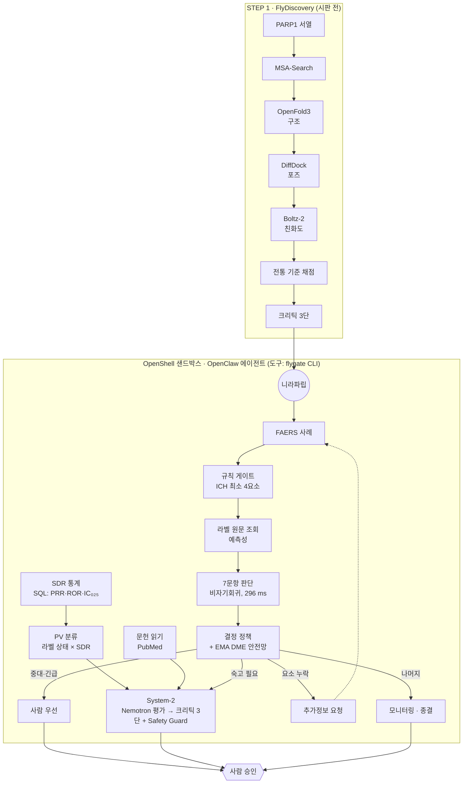

# Project-FlyGate 아키텍처

판: v3.0.0 · 작성일: 2026-09-28 · 이전 판: [archive/ARCHITECTURE_v1.0.0.md](archive/ARCHITECTURE_v1.0.0.md)

Project-FlyGate는 NVIDIA 스킬(build.nvidia.com NIM · NVIDIA Agent Skills · NemoClaw/OpenShell/OpenClaw) 위에 구성한 에이전트 워크플로입니다. 글을 써야 하는 일은 NVIDIA Nemotron이 맡고, 확률만 필요한 판단에는 비자기회귀 판단 모델을 함께 씁니다. 이 문서는 그 구조를 한 장으로 정리합니다. 설계를 뒷받침하는 측정은 [EVALUATION.md](EVALUATION.md)에 있습니다.

## 1. 한 장 구조

STEP 1은 시판 전 후보 물질을, STEP 2는 시판 후 허가 약물을 다룹니다. 데모에서는 이미 허가된 니라파립으로 STEP 1을 되짚어 재현하고 같은 약의 시판 후 보고로 이어 보여 드립니다. 두 사슬 모두 다른 표적과 약물에 그대로 씁니다. STEP 2는 반사 판단(규칙 게이트 → 라벨 원문 조회 → 7문항 판단 → 결정 정책)과, SDR 통계·PV 분류·문헌 읽기가 근거로 들어가는 System-2 숙고(Nemotron 평가 → 크리틱 3단 + Safety Guard)로 나뉩니다. 모든 경로는 사람 승인에서 만납니다. 보고서를 밖으로 내보내는 경로는 없습니다.

## 2. 부품 표

| 부품 | 코드 경로 | 모델 |
| --- | --- | --- |
| STEP 1 구조·도킹·친화도 | `fly_discovery/`(원본 `measurements/`) | NVIDIA BioNeMo NIM (MSA-Search, OpenFold3, DiffDock, Boltz-2) |
| STEP 1 크리틱 3단 | `fly_discovery/measurements/nim/`(판정 원본) | NVIDIA Nemotron 3 Super |
| 규칙 게이트 | `api/_fv/triage.py::validity` | 없음 |
| 라벨 원문 조회 | `api/_fv/labeltext.py`, `api/_fv/triage.py::ground` | 없음 |
| 7문항 판단 (반사) | `api/_fv/triage.py::triage` | 비자기회귀 판단 모델 |
| 결정 정책 + DME 안전망 | `api/_fv/triage.py::route_policy` | 없음 |
| SDR 통계 | `api/_fv/pvstats.py`, `pipeline/faers/model.sql` | 없음 (SQL) |
| PV 분류 | `api/_fv/grade.py` | 없음 (규칙) |
| 지식 기반 판별 | `api/_fv/knowledge.py` | 비자기회귀 판단 모델 |
| 문헌 읽기 | `api/_fv/literature.py` | 비자기회귀 판단 모델 |
| System-2 평가 | `api/_fv/assess.py::assess` | NVIDIA Nemotron 3 Super → Ultra → 3.5 Lightning |
| 크리틱 T1·T2 | `api/_fv/assess.py::tier1_rules/tier2_oracle` | 없음 |
| 크리틱 T3 (과잉해석) | `api/_fv/assess.py::tier3_judge` | 비자기회귀 판단 모델 |
| Safety Guard | `api/_fv/assess.py::guard` | NVIDIA Nemotron Safety Guard 8B v3 (대체: `nemotron-3.5-content-safety`) |
| 국내 보고 구조화 | `api/_fv/kr.py::intake` | NVIDIA Nemotron |
| 한국형 인과성 평가 ver 2.0 | `api/_fv/kr.py::causality_kr` | 비자기회귀 판단 모델 + 규칙 |
| 에이전트 도구 | `agent/flygate.py` | – |
| 사람 승인 | 사람 큐(대시보드) | – |

비자기회귀 판단 모델로는 TypeSafe AI의 Jev를 FlyVigilance 안에서 씁니다.

## 3. 사례 한 건이 지나가는 길

`api/_fv/triage.py::triage`가 다음 네 단계를 차례로 실행합니다.

1. **규칙 게이트** (`validity`): ICH 최소 4요소(보고자, 환자, 의심약, 이상사례)를 구조화 필드로 판정합니다. 모델은 쓰지 않습니다.
2. **라벨 원문 조회** (`ground`)
   - 주 의심약의 openFDA 라벨에서, 비임상 PT를 뺀 주요 반응 최대 5개의 기재 여부를 찾습니다.
   - 라벨이 있으면 "예상된 반응" 여부를 규칙으로 정합니다. 주요 반응 3개가 모두 기재되어 있을 때만 예상된 반응입니다.
   - 결과는 상태 문자열에 한 줄로 들어갑니다(`Label check (US label …)`). 라벨 조회는 문서 캐시 후 중앙값 1.7ms입니다.
   - 라벨을 찾지 못하면 판단 모델의 `expected` 판단을 쓰고, 출처 필드는 `jev`로 남깁니다.
3. **7문항 판단** (비자기회귀 판단 모델 한 번 호출, p50 296 ms)
   - 문항: `serious`, `expected`, `causality`, `special`, `priority`, `route`, `deep`
   - 형식: 확률(noul), 범주(choice), 점수(score)
4. **결정 정책** (`route_policy`): 확률을 행동으로 바꾸는 규칙표입니다. 모든 결정에 사유 문자열이 붙습니다.

| 순서 | 조건 | 행동 | 기한 |
| --- | --- | --- | --- |
| 1 | ICH 최소 요소 누락 | `follow_up` (추가정보 요청) | 없음 |
| 2 | **KR 모드**: 중대성 ≥ 0.5 | `expedite` | 15일 이내 (의약품 등의 안전에 관한 규칙 별표 4의3 제7호, "예상하지 못한" 요건 없음) |
| 3 | **US 모드**: 중대성 ≥ 0.5 이고 예상됨 < 0.5 (라벨 조회값 우선) | `expedite` | 15 calendar days (21 CFR 314.80) |
| 4 | 우선순위 점수 ≥ 2.5 또는 EMA DME 62개 PT 해당 | `expedite` | 즉시 사람 검토 (신속보고 요건 아님) |
| 5 | 판단 모델이 `signal_review` 선택, 숙고 필요 ≥ 0.5, 또는 인과성·경로 신뢰도 < 0.55 | `signal_review` (System-2) | 없음 |
| 6 | 나머지 | `monitor` 또는 `close` | 없음 |

같은 판단을 두 규정으로 각각 라우팅할 수 있습니다(`POST /api/triage?regime=KR`).

결과 코드를 가린 FAERS 440건(중대 250건)에서 이 경로는 중대 사례 **247/250**을 검토(사람 우선·System-2·추가정보 요청)에 닿게 했고, 사람 우선 업무량은 **138건**이었습니다. 같은 판단 모델에 질문 하나("먼저 봐야 하나?")만 물은 기준 조건은 각각 234/250, 302건입니다(McNemar p = 0.0044, p = 3.6×10⁻⁴⁸). 7문항 판단을 자기회귀 생성으로 바꾸면 같은 항목에 2,286 ms가 걸립니다. 자세한 실험 조건은 [EVALUATION.md §2](EVALUATION.md)에 있습니다.

## 4. PV 분류와 SDR

`api/_fv/grade.py`는 두 축을 규칙으로 합쳐 PV 분류를 정합니다. 모델은 쓰지 않습니다.

- **SDR**(불균형 보고 신호): Evans(PRR≥2, χ²≥4, a≥3) ∧ ROR₀₂₅>1 ∧ IC₀₂₅>0을 모두 넘은 상태입니다. SDR은 그 자체로 검증된 신호는 아니며, 규제기관 평가를 거쳐야 합니다(EU GVP Module IX).
- **라벨 상태**: 박스 경고 / 경고·주의사항 / 이상반응(임상시험·시판 후·구분 없음) / 미기재 / 확인 불가. 금기 절은 환자 조건을 적는 절이라 이상반응 기재로 세지 않습니다.

| 라벨 상태 \ SDR | 3중 기준 SDR | 약한 신호 · SDR 없음 · 보고 부족 | 통계 없음 |
| --- | --- | --- | --- |
| 기재(박스 경고·경고·이상반응), 인과 미확립 단서 없음 | **규명된 위해성 후보** | 알려진 위험 · SDR 없음 | 알려진 위험 · SDR 없음 |
| 기재 + 그 반응의 인과 미확립 단서 있음 | **잠재적 위해성 후보** | 잠재적 위해성 후보 | 잠재적 위해성 후보 |
| 라벨 미기재 | **검토가 필요한 SDR** | 해당 없음 | 판정 불가 |
| 라벨 확인 불가 | **검토가 필요한 SDR** | 판정 불가 | 판정 불가 |

- 실제 분류는 허가권자와 규제기관이 평가해서 정하므로, 도구 결과에는 항상 '후보'를 붙입니다. 검토 우선순위는 라벨에 없는데 SDR이 선 쌍을 가장 먼저 두는 PV 실무 순서를 따릅니다. EMA DME 62개 PT는 분류와 관계없이 우선순위를 올립니다.
- 따로 붙이는 표시: 심각성(박스 경고), 보고 편향 의심(변호사·소비자 보고 편중 — 예: 이소트레티노인–염증성장질환은 보고의 94.9%가 변호사 보고), 문헌 근거 수준(분석 연구 지지·결과 혼재·지지 안 함·없음, 참고 축), 적응증 교란.
- PV 분류마다 근거 ID 목록(`basis`)과 공백(`gaps`)을 함께 돌려줍니다. 공백의 예로는 통계 부족, 미국 라벨 없음(국내 허가사항은 의약품안전나라에서 확인), 문헌 미확인이 있습니다. 크리틱 R13이 PV 분류를 근거 없이 인용하거나 인과의 증거로 쓰는 주장을 막습니다.
- 세 조합에 대한 점검 결과는 [EVALUATION.md §4](EVALUATION.md)에 있습니다.

## 5. 크리틱 3단 + 가드

| 단 | 검사 | 모델 |
| --- | --- | --- |
| T1 | 주장이 비어 있지 않은지, 근거 ID가 있는지, 그 ID가 근거 묶음에 실재하는지 | 없음 |
| T2 | 주장 속 모든 숫자가 사례나 근거 묶음의 숫자와 ±1.1% 안에서 일치하는지 | 없음 |
| T3 | 주장마다 과잉해석 규칙 R1–R13 위반 확률(noul)과 어느 규칙인지(choice) | 비자기회귀 판단 모델 |
| Guard | 주장마다 개별 치료 조언(Unauthorized Advice)을 막음 → R11 | `nvidia/llama-3.1-nemotron-safety-guard-8b-v3` (대체: `nemotron-3.5-content-safety`) |

- **재작성**: 반려되면 사유를 붙여 Nemotron에게 한 번 되돌려 다시 쓰게 합니다.
- **빈 메모**: 주장이 하나도 없는 메모(JSON이 깨진 경우 포함)는 T1이 반려합니다. System-2는 NIM의 JSON 모드(`response_format: json_object`)로 부릅니다.
- **근거 ID 정규화**: 모델이 근거 목록 줄(`ID :: 설명`)을 통째로 옮기면 ID 부분만 남깁니다. ID 자체는 정확히 일치해야 합니다. FAERS 복합제 이름의 역슬래시는 ID에서 `+`로 씁니다.
- **가드 검사 단위**: 가드는 메모를 이어 붙이지 않고 주장마다 따로 검사합니다.
- **가드 장애 대응**: 기본 가드가 응답하지 않으면 대체 가드로 넘어갑니다. 둘 다 안 되면 통과가 아니라 "사람 확인"으로 표시합니다.
- **시간 예산**: 숙고 층 전체에 100초, 가드에 20초를 둡니다. Vercel 함수 제한(120초) 안에서 끝내기 위해서입니다.

일부러 넣은 틀린 주장 31/31이 크리틱을 통과하지 못했고, 정상 주장 6/6은 통과했습니다. 자세한 방법과 표는 [EVALUATION.md §5](EVALUATION.md)에 있습니다.

## 6. 국내 약물감시 모드

| 기능 | 코드 | 방식 |
| --- | --- | --- |
| 보고 구조화 | `kr.py::intake`, `POST /api/kr/intake` | Nemotron이 식약처 공고 제2023-057호 서식의 가~바 섹션을 채우고, 빠진 정보는 추가정보 요청으로 돌립니다. 약물 역할·보고자·결과 코드는 규칙으로 만듭니다 |
| 한국형 인과성 평가 ver 2.0 | `kr.py::causality_kr`, `POST /api/kr/causality` | 8개 항목 중 7개를 비자기회귀 판단 모델 한 번 호출로 판단하고, 점수(−13~19)와 등급은 규칙으로 계산합니다 |
| 규정 모드 | `route_policy(regime="KR")` | §3의 2번 규칙을 씁니다 |

"약물에 대해 알려진 정보" 항목은 모델에 먼저 묻지 않고 다음 순서로 정합니다.
1. 라벨에 기재되어 있으면 +3 (출처: openFDA 라벨)
2. 라벨에 없고 PubMed 문헌 읽기에서 연관을 보고한 문헌이 있으면 +2 (출처: 문헌 읽기)
3. 둘 다 아니면 판단 모델의 판단

## 7. 에이전트 배치

에이전트는 OpenShell 샌드박스 안에서 도는 OpenClaw이고, 도구는 `flygate` CLI 하나입니다(`agent/flygate.py`). 하위 명령은 `triage`, `grade`, `signals`, `kr-causality`, `critic`, `discover`, `watch`이며, 결과마다 근거 ID를 붙여 JSON으로 돌려줍니다.

- **OpenClaw 작업 공간** (`agent/workspace/`): `SOUL.md`(정체성), `AGENTS.md`, `IDENTITY.md`, `TOOLS.md`, `HEARTBEAT.md`, `USER.md`, `MEMORY.md`.
- **OpenShell 정책** (`agent/policy/flygate.yaml`)의 원칙은 다음과 같습니다.
  1. 나가는 연결은 기본 거부이며, 정책에 적힌 호스트·포트·메서드·경로·실행 파일 조합만 엽니다.
  2. 외부 API는 파이썬 실행 파일에만 묶습니다.
  3. 쓰기는 `/tmp`, `/sandbox/.openclaw`, `/sandbox/.nemoclaw`, 작업 디렉터리(`/sandbox`)만입니다.
  4. 에이전트는 root가 아닌 `sandbox` 사용자로 돕니다.
  5. 보고서를 밖으로 내보내는 경로(메일, 메신저, 규제기관 포털, GitHub, 붙여넣기 사이트)는 하나도 열지 않습니다. 제출은 사람이 합니다.
- **하트비트** (`flygate.py::cmd_watch`): 최신 FAERS 분기를 감지하고, 감시 목록(니라파립 계열·보고 편향 사례 포함)의 신호를 재계산하고, 날짜별 메모와 사람 검토 대기열을 씁니다.

에이전트 구성의 전체 내용과 스모크 기록은 [docs/AGENT.md](AGENT.md)에 있습니다.

## 8. 커넥텀 시각화

대시보드의 MaleCNS 초파리 커넥텀 화면(중앙뇌·하행·상행·시각투사 49,244 뉴런)은 STEP 2 반사·숙고·크리틱 경로가 어떤 뉴런 집단에 대응하는지를 보여 주는 라우팅 위상 시각화입니다. 동역학은 브라우저에서 실제 시냅스 가중치를 따라 전파하지만, 임상 근거가 아니라 구조 설명 도구입니다.
