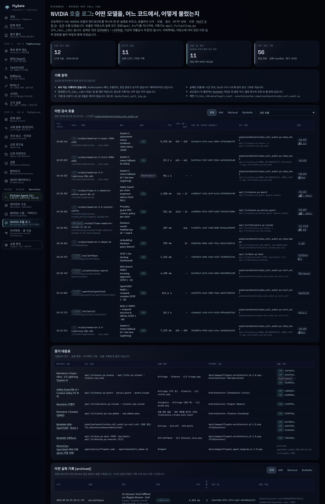

# NVIDIA 호출 로그 v1.0.0

이 문서는 FlyGate가 어떤 NVIDIA 기술을 어느 코드에서 어떻게 부르는지, 실제 호출 기록으로 보여 드립니다.
해커톤 제출 양식이 요구하는 "기술 활용을 확인할 수 있는 자료" 가운데 코드, 실행 화면, 아키텍처 구조도는 이미 있었고, 이번에 **호출 로그**를 더했습니다.

- 대시보드 화면: [project-flygate.vercel.app/#/calls](https://project-flygate.vercel.app/#/calls) (메뉴 `에이전트 · NVIDIA` → `NVIDIA 호출 로그`)
- 커밋된 요약: [`web/public/data/nvidia_calls.json`](../web/public/data/nvidia_calls.json)
- 호출 기록기: [`api/_fv/calllog.py`](../api/_fv/calllog.py), 테스트: [`tests/test_call_log.py`](../tests/test_call_log.py)
- 감사 스크립트: [`pipeline/bench/nvidia_call_audit.py`](../pipeline/bench/nvidia_call_audit.py)



> **API 키는 기록하지 않습니다.** 인증 헤더, 프롬프트, 모델 응답 본문도 남기지 않습니다. 호출마다 메타데이터(시각, 모델, 용도, 상태, 지연, 요청 ID, 토큰 수)만 남깁니다.

## 1. 기록 방식

### 켜고 끄기

환경변수 `FV_CALL_LOG`에 파일 경로를 주면 켜집니다. NVIDIA를 한 번 부를 때마다 그 파일에 JSON 한 줄을 덧붙입니다(JSONL, 한 줄에 기록 하나).
변수가 없으면 기록기는 곧바로 돌아가므로 운영 경로에 비용이 들지 않습니다. 기록 중에 오류가 나도 예외를 올리지 않아 본 호출은 깨지지 않습니다.

```bash
FV_CALL_LOG=data/logs/x.jsonl .venv/bin/python pipeline/bench/nvidia_call_audit.py
```

### 기록하는 항목

| 필드 | 뜻 |
| --- | --- |
| `ts_utc` | 응답을 받은 시각(UTC, 협정 세계시) |
| `service` · `host` · `endpoint` | 서비스 묶음과 호스트, 경로. 쿼리 문자열은 버립니다 |
| `model` | 부른 모델 이름 |
| `purpose` | 이 호출을 한 이유(예: System-2 평가 메모, PV 정책 가드, 문헌 재정렬, 구조 예측) |
| `http_status` · `error` | HTTP 상태 코드와 오류 종류(예외 이름만. 오류 메시지 본문은 남기지 않습니다) |
| `latency_ms` | 요청을 보내고 응답을 받기까지 걸린 시간(밀리초) |
| `nvcf_reqid` | NVIDIA 서버가 응답 헤더 `NVCF-REQID`에 붙여 주는 호출별 접수 번호. 202(접수) 후 폴링하는 작업은 그 작업의 요청 ID입니다 |
| `usage` | 토큰 수(입력 `prompt_tokens`, 출력 `completion_tokens`, 합계). 토큰은 모델이 글을 자르는 단위입니다 |
| `bytes_out` · `bytes_in` | 보낸 요청과 받은 응답의 크기(바이트). 크기만 세고 내용은 읽지 않습니다 |
| `cache_hit` | 저장해 둔 결과를 써서 NVIDIA를 부르지 않았는지 여부 |
| `code_path` | 호출을 일으킨 저장소 안 위치(`파일:함수`) |
| 추가 필드 | `json_mode`, `attempt`(몇 번째 시도), `polls`(폴링 횟수), `template`(예: `custom_policy+request_categories`), `n_inputs`, `fallback_of`(폴백이면 원래 모델), `response_id` |

추가 필드는 허용 목록에 있는 키만 받고, 값도 짧은 숫자·참거짓·식별자 모양만 받습니다. 공백이 든 문장이나 키처럼 보이는 문자열은 들어갈 수 없습니다. 테스트가 키·인증 헤더·환자 서술 모양의 문자열·응답 본문이 기록 파일에 한 글자도 남지 않는지 확인합니다.

### 기록기가 붙은 곳

| 코드 | NVIDIA 호출 |
| --- | --- |
| `api/_fv/clients.py:nim_chat` | build.nvidia.com NIM chat completions. 시도마다 한 줄(폴백·재시도 포함) |
| `api/_fv/clients.py:nim_embed` · `nim_embed_many` | NIM embeddings |
| `api/_fv/clients.py:nim_rerank` | Retrieval NIM reranking. 시간 초과로 취소된 호출도 적습니다 |
| `api/_fv/literature.py:rerank` | 리랭커 결과를 캐시에서 꺼냈을 때 `cache_hit=true` 한 줄 |
| `api/_fv/dock.py:dock` | 대시보드 실시간 도킹(DiffDock). 202 폴링을 묶어 한 줄, 메모리 캐시 적중도 한 줄 |
| `api/_fv/docking.py:execute` | CLI `flygate discover --live`의 DiffDock 실행. 실행 한 번에 한 줄(`run_id`, 폴링 횟수) |
| `pipeline/bench/nvidia_call_audit.py:nvcf_call` | BioNeMo 구조 NIM(MSA-Search, OpenFold3, Boltz-2) |

호출하는 쪽은 `purpose`만 넘깁니다: 평가 메모(`assess.py:assess`), 국내 보고 구조화(`kr.py:intake`), 기본 가드(`assess.py:guard`), PV 정책 가드(`assess.py:policy_guard`).

## 2. 이번 감사 호출 (2026-09-28)

`pipeline/bench/nvidia_call_audit.py`로 프로젝트가 쓰는 NVIDIA 모델·엔드포인트를 하나씩 한 번 불렀습니다.
캐시는 모두 우회했고(`FV_CACHE_DIR` 해제, 메모리 캐시 비움), 입력은 데모 값만 썼습니다: PARP1 촉매 도메인(350 아미노산) + 니라파립, 그리고 **가상의** 약물감시 사례와 주장입니다. 실제 환자 정보는 쓰지 않았습니다.
시각은 응답을 받은 때입니다. 실패한 호출도 지우지 않고 그대로 두었습니다.

| # | 시각 (UTC) | 모델 · 서비스 | 용도 | 상태 | 지연 | 토큰 in → out | 요청 ID (NVCF-REQID) | 기록된 코드 위치 |
| --- | --- | --- | --- | --- | --- | --- | --- | --- |
| 1 | 10:08:44.686 | `nvidia/nemotron-3-super-120b-a12b` · NIM | System-2 평가 메모(근거 ID가 붙은 주장, JSON 모드) | 200 | 5,243 ms | 655 → 338 | `12efeb74-4ff4-4eec-80fb-4276fdd9bf3f` | `pipeline/bench/nvidia_call_audit.py:step_chat` |
| 2 | 10:09:03.856 | `nvidia/nemotron-3-ultra-550b-a55b` · NIM | System-2 메모 폴백 2순위(Ultra) | 200 | 19.2 s | 655 → 483 | `5e2d7d44-7e5f-481f-8263-665365d23cd0` | `pipeline/bench/nvidia_call_audit.py:step_chat` |
| 3 | 10:10:33.942 | `nvidia/nemotron-3.5-lightning-30b-a3b` · NIM | System-2 메모 폴백 3순위 · 빠른 경로(Lightning) | **ReadTimeout** | 90.1 s | — | — | `pipeline/bench/nvidia_call_audit.py:step_chat` |
| 4 | 10:10:35.510 | `nvidia/llama-3.1-nemotron-safety-guard-8b-v3` · NIM | Safety Guard: 주장별 치료 조언 검사(R11) | 200 | 1,558 ms | 414 → 17 | `c4010a57-c3ba-4b49-bcd1-52fb959e5fd8` | `api/_fv/assess.py:guard` |
| 5 | 10:10:36.033 | `nvidia/nemotron-3.5-content-safety` · NIM | PV 정책 가드: BYO `custom_policy` | 200 | 511 ms | 2332 → 12 | `cda0506e-2632-4039-be05-7d45d2fc600a` | `api/_fv/assess.py:policy_guard` |
| 6 | 10:10:36.340 | `nvidia/llama-nemotron-rerank-vl-1b-v2` · Retrieval NIM | 문헌 재정렬: PubMed 후보 → 읽을 논문 | 200 | 297 ms | 546 | `fc620f5c-cadf-43d8-8b85-0f36acd9d0f8` | `api/_fv/literature.py:rerank` |
| 7 | 10:10:36.585 | `nvidia/nemotron-3-embed-1b` · NIM | 임베딩: 문헌 질의 | 200 | 235 ms | 11 | `2930f386-9881-450f-931c-062ef1f89cf6` | `pipeline/bench/nvidia_call_audit.py:step_embed` |
| 8 | 10:10:37.717 | `mit/diffdock` · BioNeMo NIM | STEP 1 실시간 도킹(대시보드 경로) | 200 | 1,124 ms | — | `748a9d63-cb8e-42da-bc85-7628d9ae7e1b` | `api/_fv/dock.py:dock` |
| 9 | 10:10:42.215 | `colabfold/msa-search` · BioNeMo NIM | MSA-Search: PARP1 상동 서열 정렬 | 200 | 4,495 ms | — | `2e4f60c3-def2-4f6d-b504-03d4909e1150` | `pipeline/bench/nvidia_call_audit.py:nvcf_call` |
| 10 | 10:13:06.860 | `openfold/openfold3` · BioNeMo NIM | OpenFold3: PARP1 + 니라파립 복합체 구조 예측 | 200 | 144.6 s | — | `a2623953-6a1b-480b-9da1-d6de77d83e54` | `pipeline/bench/nvidia_call_audit.py:nvcf_call` |
| 11 | 10:13:17.186 | `mit/boltz2` · BioNeMo NIM | Boltz-2: PARP1 + 니라파립 구조 · 친화도 예측 | 200 | 10.3 s | — | `41a6eab2-c346-4c74-8a18-d954d6a5f3a2` | `pipeline/bench/nvidia_call_audit.py:nvcf_call` |
| 12 | 10:23:21.415 | `nvidia/nemotron-3.5-lightning-30b-a3b` · NIM | 3번 재실행(같은 입력) | 200 | 7,212 ms | 655 → 289 | `78c8987a-9f08-4d11-b7ac-3e56034b6349` | `pipeline/bench/nvidia_call_audit.py:step_chat` |

### 호출 결과 (모두 데모 입력 기준)

- **Nemotron 3 Super · Ultra · 3.5 Lightning**: 세 모델 모두 JSON으로 읽히는 평가 메모를 돌려주었습니다(주장 2개, 5개, 2개).
- **Safety Guard 8B v3**: 가상 치료 조언 문장("오늘 복용을 중단하고 다른 약을 드시라")을 `unsafe`, 범주 `Unauthorized Advice`로 판정했습니다.
- **Content Safety + PV 정책**: "PRR 9.41이 인과를 증명한다"는 가상 주장을 `unsafe`, 범주 PV-2(규칙 R1: 불균형 분석은 인과가 아닙니다)로 판정했습니다.
- **리랭커**: 가상 논문 8편 중 약물–반응과 관련된 3편(PubMed 순서 1, 3, 5번)을 위로 올렸습니다.
- **Embed 1B**: 2,048차원 벡터를 돌려주었습니다.
- **DiffDock**: 4R6E 수용체에 니라파립 포즈 3개, 1순위 포즈 신뢰도 0.856입니다(신뢰도는 포즈가 맞을 가능성이지 결합력이 아닙니다).
- **MSA-Search**: Uniref30_2302에서 상동 서열 127개(최대 128개로 요청)를 받았습니다.
- **OpenFold3**: 이번에 받은 정렬로 예측했고 pLDDT(잔기별 구조 신뢰도) 95.77, ipTM(사슬 사이 접촉 신뢰도) 0.675입니다. 저장소의 이전 실측(95.95, 0.658)과 가깝습니다.
- **Boltz-2**: 예측 pIC50 8.101입니다(예측값이며 실측 친화도가 아닙니다).

### 실패와 재실행

- 3번 **Nemotron 3.5 Lightning**은 90초 안에 응답이 없어 `ReadTimeout`으로 끝났습니다. 운영 경로(`nim_chat`)에서는 이런 경우 같은 모델을 다시 부르지 않고 사슬의 다음 모델로 넘어갑니다. 약 10분 뒤 같은 입력으로 한 번 더 불러 12번처럼 200을 받았습니다. 두 줄을 모두 남겼습니다.
- OpenFold3는 504(게이트웨이 시간 초과)가 날 수 있는 엔드포인트여서 폴링 예산을 420초로 잡았습니다. 이번에는 144.6초에 200으로 끝났습니다.

## 3. 이전 실측 기록 (archived)

감사 전에 저장소에 이미 있던 NVIDIA 호출 증거입니다. 대시보드 `#/calls` 아래쪽 표와 `nvidia_calls.json`의 `archived`에 출처 파일과 함께 56건을 모았습니다.
원본 응답 파일에는 요청 ID가 없는 경우가 많아, 시각은 파일이 저장소에 처음 들어온 커밋 시각(KST, 한국 표준시)이나 파일 안의 기록 시각을 씁니다.

| 묶음 | 출처 | 내용 |
| --- | --- | --- |
| DiffDock CLI 실행 4건 | `data/discovery-runs/*/manifest.json` (로컬, `.gitignore`) | `flygate discover --live` 실행. 요청 ID(`2464f506-…`, `31a2fe95-…`, `da368e72-…`, `69a8d847-…`), UTC 시각, 입력·응답 SHA-256이 남아 있습니다. 2026-09-28 07:18 – 09:34 UTC |
| DiffDock 재도킹 · 대표 장면 24건 | `fly_discovery/measurements/nim/dd_*.json`, `diffdock_niraparib_parp1.json` | 13개 표적의 결정 리간드 재도킹 원본 응답(포즈 5개씩, `success without retry`) |
| Boltz-2 9건 | `fly_discovery/measurements/nim/boltz2_*.json` | 구조·친화도 원본 응답. 파일 안의 서버 처리 시간 9.0 – 12.0초 |
| OpenFold3 1건 | `fly_discovery/measurements/nim/openfold3_parp1_niraparib.json` | pLDDT 95.95 · ipTM 0.658 |
| MSA-Search 1건 | `fly_discovery/measurements/nim/parp1.a3m` | 상동 서열 100개 + 쿼리, 63.6초(`fly_discovery/README.md`) |
| OpenFold2 실패 1건 | `fly_discovery/measurements/nim/openfold2_resp.json` | HTTP 500(서버 CUDA 오류). 6회 시도 후 OpenFold3로 바꿨습니다 |
| FlyDiscovery 크리틱 · 주제 게이트 | `fly_discovery/measurements/nim/critic_v2.json`, `topic_gate_llm.json` | Super · Lightning으로 주장 8건, 질문 6건을 판정한 묶음 기록 |
| System-2 데모 사례 2회 | `web/public/data/demo_case_v2.json` | Nemotron 3 Super 평가 메모 1·2회차: 10.8초 · 13.6초, 토큰 2825 → 779, 2888 → 617 |
| 가드 평가 | `web/public/data/guard_policy_eval.json` | 주장 87건에 Safety Guard 8B v3와 Content Safety(기본 · PV 정책 · 추론 켬)를 돌린 중앙 지연 692 · 356 · 459 · 4,292 ms |
| 리랭커 · 임베딩 평가 | `web/public/data/literature_rerank_eval.json` | 리랭커 90회 p50 430 ms(최대 716 ms), 임베딩 기준선 2종 |
| Nemotron 벤치마크 | `web/public/data/bench.json` | 3.5 Lightning으로 FAERS 표본 30건 판정(p50 676 ms · 2,286 ms, 오류 수 포함) |
| OpenShell 샌드박스 | `agent/evidence/openshell_smoke_2026-09-28.txt` | 샌드박스 안에서 `integrate.api.nvidia.com/v1/models` HTTP 200(정책이 NIM만 열어 둔 것을 확인). 2026-09-28 04:52 UTC |

## 4. 증거 대응표

NVIDIA 기술마다 코드 · 실행 화면 · 아키텍처 그림 · 호출 기록을 한 줄로 잇습니다. 화면 경로는 [project-flygate.vercel.app](https://project-flygate.vercel.app) 기준이고, 쇼릴은 대시보드 메뉴의 `FlyGate_showreel_v4.2.0.html`입니다.

| NVIDIA 기술 | 코드 경로 | 실행 화면 | 아키텍처 그림 | 호출 기록 |
| --- | --- | --- | --- | --- |
| Nemotron 3 Super 120B (JSON 모드) · Ultra 550B · 3.5 Lightning 30B 폴백 사슬 | `api/_fv/assess.py:assess`, `api/_fv/kr.py:intake` → `api/_fv/clients.py:nim_chat`, 모델 사슬 `api/_fv/config.py:MODEL_DELIBERATE` | `#/triage`(System-2 평가 메모), `#/korea`(국내 서식 구조화), 쇼릴 `triage` 1:19 · `korean` 1:31, CLI `web/public/cli/captures/triage.png` · `kr_causality.png` | `docs/images/flygate-architecture_v2.1.0.png`, `#/architecture`(Deliberation 층 · Model plane), `docs/ARCHITECTURE.md` | 감사 #1 · #2 · #3(실패) · #12, archived `demo_case_v2.json` · `bench.json` |
| Nemotron Safety Guard 8B v3 + Nemotron 3.5 Content Safety(PV `custom_policy`) | `api/_fv/assess.py:guard` · `policy_guard` · `guard_claims`, 정책 `api/_data/pv_guard_policy.txt`, 스킬 `skills/pv-guardrail-policy/` | `#/triage`(주장별 가드 결과), `#/skills`, 쇼릴 `nvskills` 2:35, CLI `critic.png` | `#/architecture`(Inhibitory Critic 층) | 감사 #4 · #5, archived `guard_policy_eval.json` |
| Nemotron 리랭커 `llama-nemotron-rerank-vl-1b-v2` | `api/_fv/literature.py:rerank` → `api/_fv/clients.py:nim_rerank` | `#/signals`(PV 분류 카드의 문헌 축), `#/triage`, 쇼릴 `signals` 1:45, CLI `grade.png` | `#/architecture`(Signal Memory 층: 문헌 기억) | 감사 #6, archived `literature_rerank_eval.json` |
| Nemotron 3 Embed 1B | `api/_fv/clients.py:nim_embed` · `nim_embed_many`, 평가 `pipeline/bench/literature_rerank_eval.py` | 전용 화면 없음(재정렬 평가의 기준선), `#/calls` | `#/architecture`(Feature Encoding 층: 임베딩) | 감사 #7, archived `literature_rerank_eval.json` |
| BioNeMo MSA-Search → OpenFold3 | 감사 `pipeline/bench/nvidia_call_audit.py:nvcf_call`, 원본 사용처 `pipeline/discovery/build_hero_scene.py` | `#/d-msa`, `#/d-of3`, 쇼릴 `disc` 0:16 | `docs/images/flygate-architecture_v2.1.0.png`(FlyDiscovery) | 감사 #9 · #10, archived `parp1.a3m` · `openfold3_parp1_niraparib.json` · `openfold2_resp.json`(500) |
| BioNeMo DiffDock | `api/_fv/dock.py:dock`(`POST /api/dock`), `api/_fv/docking.py:execute`(`flygate discover --live`), 재도킹 `pipeline/discovery/redock.py` | `#/d-diffdock`, `#/cli`, 쇼릴 `disc` 0:16 · `panel` 0:40, CLI `discover_live.png` | 같은 그림(FlyDiscovery) | 감사 #8, archived CLI 실행 4건(요청 ID) · 원본 응답 24건 |
| BioNeMo Boltz-2 | 감사 `pipeline/bench/nvidia_call_audit.py:nvcf_call`, 원본 사용처 `pipeline/discovery/build_hero_scene.py` · `build_evidence_cards.py` | `#/d-boltz`, 쇼릴 `disc` 0:16 | 같은 그림(FlyDiscovery) | 감사 #11, archived `boltz2_*.json` 9건 |
| NemoClaw · OpenShell(NIM 전용 egress) | `agent/policy/flygate.yaml`, `agent/openshell_smoke.sh` | `#/agent`, 쇼릴 `agent` 3:07 | `docs/images/flygate_agent_diagram_v1.1.0.png` | archived `openshell_smoke_2026-09-28.txt` |

## 5. 다시 해 보기

```bash
# 저장소 최상위에서. .env 에 NVIDIA_API_KEY 가 있어야 합니다(커밋하지 않습니다)
FV_CALL_LOG=data/logs/x.jsonl .venv/bin/python pipeline/bench/nvidia_call_audit.py

# 구조 NIM(MSA-Search · OpenFold3 · Boltz-2)을 빼고 빠르게
FV_CALL_LOG=data/logs/x.jsonl .venv/bin/python pipeline/bench/nvidia_call_audit.py --skip-structure

# 한 단계만 다시(이전 줄은 지우지 않고 뒤에 덧붙입니다)
FV_CALL_LOG=data/logs/x.jsonl .venv/bin/python pipeline/bench/nvidia_call_audit.py --only lightning

# 운영 API 를 띄운 채 기록만 켜기
FV_CALL_LOG=data/logs/api_calls.jsonl .venv/bin/uvicorn api.index:app --port 8000

# 테스트(네트워크 없이)
.venv/bin/python -m pytest -q tests/test_call_log.py
```

원본 기록(`data/logs/*.jsonl`)은 `.gitignore` 대상이라 커밋하지 않습니다. 커밋하는 것은 같은 내용을 정리한 `web/public/data/nvidia_calls.json`입니다.

## 6. 알아 두실 점

- BioNeMo 구조 NIM 가운데 **MSA-Search · OpenFold3 · Boltz-2는 저장소에 런타임 클라이언트가 없습니다.** 처음 측정은 원본 응답만 `fly_discovery/measurements/nim/`에 남겼고, 대시보드는 그 저장된 결과를 보여 줍니다. 저장소 안에서 이 세 NIM을 다시 부르는 코드는 감사 스크립트의 `nvcf_call`입니다.
- Nemotron 채팅 세 모델은 운영 경로와 같은 함수(`clients.nim_chat`)와 같은 시스템 프롬프트(`assess.SYSTEM`)로 불렀지만, 호출한 위치는 감사 스크립트입니다. 그래서 `기록된 코드 위치` 열에 감사 스크립트가 나옵니다. 가드 · 리랭커 · DiffDock은 운영 함수(`assess.guard`, `assess.policy_guard`, `literature.rerank`, `dock.dock`)를 그대로 거쳤습니다.
- archived 표의 평가 묶음(가드, 리랭커, 벤치마크)은 호출마다 요청 ID를 남기지 않았던 시기의 기록입니다. 모델, 호출 수, 지연 통계만 확인하실 수 있습니다.
- 지연에는 호스팅 체험 엔드포인트의 대기열 시간이 섞입니다. 성능 비교 수치로 쓰지 마십시오.
